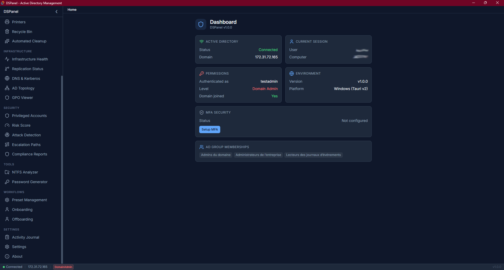
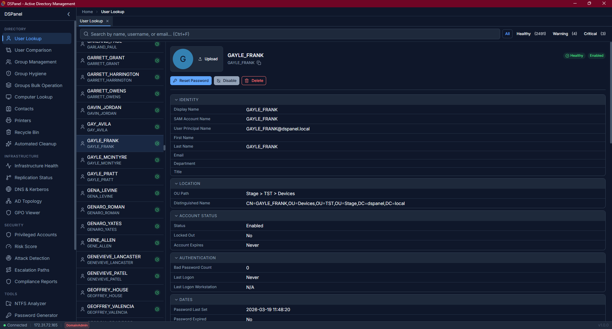
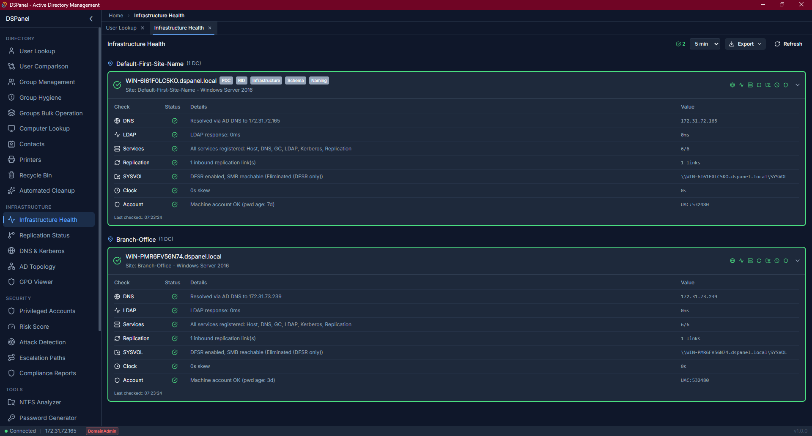
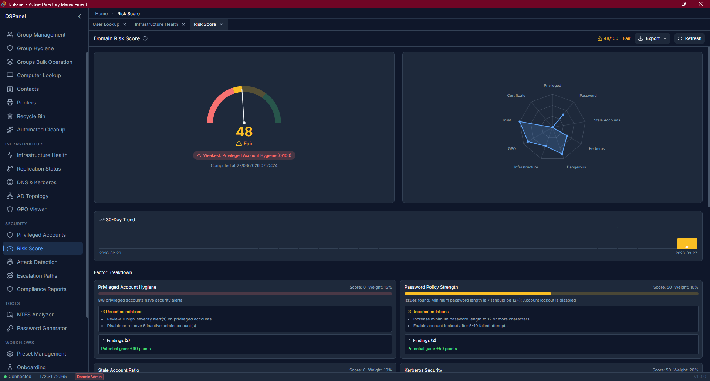
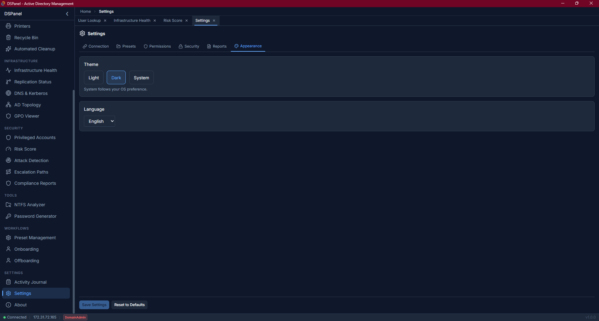

<p align="center">
  <h1 align="center">DSPanel</h1>
  <p align="center">Active Directory support and administration tool for Windows, macOS, and Linux.</p>
</p>

<p align="center">
  <a href="LICENSE"></a>
  
  
  
  
  
  
</p>

---

## Overview

DSPanel is an open source cross-platform desktop application (Rust/Tauri v2) that unifies the entire Active Directory support chain into a single tool. It dynamically adapts its interface based on the AD permissions of the current user, covering everything from read-only lookups to full domain administration.



## Features

### Directory

- **User Lookup** - Search accounts, view detailed info, healthcheck badges, group memberships, advanced attributes editor
- **Computer Lookup** - Search and browse computer accounts with OS info, last logon, health badges
- **User Comparison** - Side-by-side comparison with visual group delta (shared / only A / only B)
- **Group Management** - Tree/flat views, drag-and-drop membership, scope/category badges
- **Group Hygiene** - Detect empty, single-member, stale, undescribed, circular, deeply nested, and duplicate groups
- **Bulk Operations** - Add/remove members, clone, merge, move, create groups from CSV
- **Contact & Printer Management** - Browse, search, and edit AD contacts and printers with inline editing
- **NTFS Permissions Audit** - Cross-reference UNC path permissions with AD groups for two users



### Workflows

- **Onboarding Wizard** - Guided user creation with declarative presets (JSON)
- **Offboarding Wizard** - Disable, remove groups, reset password with preset support
- **Preset Management** - Shared preset files on network storage with integrity checking
- **Automated Cleanup** - Rules-based detection (inactive, never logged on, disabled) with dry-run, double confirmation for deletes, and service account exclusion
- **AD Recycle Bin** - Browse and restore deleted objects with type filtering and OU picker
- **Move Objects** - Move users, computers, groups, contacts, printers between OUs with dry-run preview

### Support Actions

- **Password Reset** - Reset with secure password generation (HIBP breach check)
- **Account Unlock / Enable / Disable** - One-click with confirmation
- **Password Flags** - Toggle "Password Never Expires" and "User Cannot Change Password"
- **User Photos** - View, upload (auto-resize to 96x96), and remove AD thumbnail photos
- **Password Generator** - Configurable length, character sets, pronounceable mode, HIBP check
- **Object Snapshots** - SQLite-backed attribute snapshots before every write, with diff viewer and restore

### Infrastructure

- **DC Health Checks** - 7 cross-platform checks per DC (DNS, LDAP, SPNs, replication, SYSVOL/DFSR, clock skew, machine account), FSMO roles, functional level
- **Replication Monitoring** - Partnership table with latency, error tracking, USN data, and force-replication via repadmin
- **DNS & Kerberos Validation** - SRV record validation via AD DNS (cross-platform, hickory-resolver), clock skew detection
- **AD Topology** - Site/DC/replication/site-link overview with per-DC details (IP, OS, roles, online status, subnets)
- **GPO Viewer** - GPO links per user/computer/OU with effective order, scope report, enforcement and WMI filter status
- **Workstation Monitoring** - Real-time CPU, memory, disk, sessions, and services monitoring on remote workstations



### Security

- **Privileged Accounts Audit** - Admin group members with 12 security checks per account (Kerberoastable, AS-REP Roastable, Protected Users, SIDHistory, delegation, etc.), domain findings (KRBTGT age, LAPS coverage, PSO), CSV/HTML export
- **Domain Risk Score** - Security posture scoring (0-100) with 9 weighted factors and ~70 checks, SVG gauge + radar chart, per-finding CIS/MITRE references, remediation with complexity scoring, 30-day trend, HTML report export
- **Attack Detection** - On-demand Windows Security Event Log analysis for 14 attack types (Golden Ticket, DCSync, Kerberoasting, Pass-the-Hash, etc.) with structured XML parsing and MITRE ATT&CK mapping
- **Escalation Paths** - Privilege escalation path analysis with 5 node types, 8 edge types (membership, delegation, RBCD, SIDHistory, ADCS, GPO), and weighted Dijkstra path-finding
- **Compliance Reports** - 7 checks across 9 frameworks (GDPR, HIPAA, SOX, PCI-DSS v4.0, ISO 27001, NIST 800-53, CIS v8, NIS2, ANSSI) with per-framework scoring, control references, and remediation PowerShell commands
- **MFA Gate** - TOTP verification for sensitive operations (password reset, account disable, etc.)
- **Audit Trail** - Full internal action logging for compliance with export support



### Exchange

- **Exchange On-Prem** - Read-only mailbox info from LDAP attributes (msExch*): primary SMTP, aliases, forwarding, delegates
- **Exchange Online** - Mailbox quota usage, auto-reply status, delegates via Microsoft Graph API with token caching

### Settings & UX

- **Application Settings** - Centralized settings (Connection, Presets, Permissions, Security, Reports, Appearance)
- **Custom Permission Mapping** - Map AD security groups to DSPanel permission levels via UI
- **Auto-Update Notifications** - GitHub Releases API check with Download, Skip, Remind Me Later
- **i18n** - Full localization in 5 languages: English, French, German, Italian, Spanish (1709 keys)
- **Theme** - Light, Dark, and System theme with live preview
- **Login Prompt** - Password prompt at startup when credentials are partially configured



## Adaptive Permissions

The UI adapts dynamically based on the running user's AD permissions. Detection uses three strategies (highest wins):

1. **SID-based** - automatic detection of well-known AD groups (Domain Admins, Account Operators, etc.) via RID matching - works in any AD locale
2. **Probe-based** - tests effective permissions via `allowedAttributesEffective` and `allowedChildClassesEffective` - detects delegated permissions without requiring specific group membership
3. **Custom groups** - optional AD group-to-level mapping configurable in Settings > Permissions

| Level               | Access                                                |
| ------------------- | ----------------------------------------------------- |
| **ReadOnly**        | Lookup, view, export                                  |
| **HelpDesk**        | + Password reset, unlock, diagnostics                 |
| **AccountOperator** | + Group management, presets, onboarding/offboarding   |
| **Admin**           | + Delete/move objects, create users                   |
| **DomainAdmin**     | + Built-in/sensitive objects, infrastructure           |

## Requirements

- Windows 10/11, macOS 12+, or Linux (x64)
- Network access to an Active Directory domain
- (Optional) Azure AD App Registration for Entra ID / Exchange Online features

### Authentication

DSPanel supports two authentication modes:

| Mode | When | How |
| ---- | ---- | --- |
| **GSSAPI (Kerberos)** | Domain-joined machine | Automatic - uses current user's ticket |
| **Simple Bind** | Non-domain machine or explicit credentials | Set `DSPANEL_LDAP_SERVER` + `DSPANEL_LDAP_BIND_DN` env vars. Password is prompted at startup (recommended) or set via env var (not recommended) |

### Event Log Permissions (Attack Detection)

Attack Detection reads the Windows Security Event Log on the target DC remotely. Two prerequisites:

1. The account must be a member of **Event Log Readers** on the DC
2. The **Remote Event Log Management** firewall rule must be enabled on the DC:
   ```
   netsh advfirewall firewall set rule group="Remote Event Log Management" new enable=yes
   ```

## Installation

### Portable (Windows)

Download the latest release from [GitHub Releases](https://github.com/Rwx-G/DSPanel/releases), extract, and run `DSPanel.exe`.

### Installers

- **Windows**: `.msi` or `.exe` installer
- **macOS**: `.dmg`
- **Linux**: `.deb`, `.AppImage`, `.rpm`

## Building from Source

### Prerequisites

- [Rust](https://rustup.rs/) (latest stable)
- [Node.js](https://nodejs.org/) (v20+) with [pnpm](https://pnpm.io/)
- OS-specific dependencies (see [Tauri prerequisites](https://v2.tauri.app/start/prerequisites/))

### Build

```bash
git clone https://github.com/Rwx-G/DSPanel.git
cd DSPanel
pnpm install
pnpm tauri build
```

### Dev mode

```bash
pnpm tauri dev
```

## Configuration

### LDAP Connection

By default, DSPanel uses **GSSAPI (Kerberos)** authentication on the current user's domain. For environments requiring explicit credentials:

| Variable | Description | Default |
| -------- | ----------- | ------- |
| `DSPANEL_LDAP_SERVER` | LDAP server hostname or IP. Supports `ldaps://` and `ldap://` prefixes. | Auto-detected from `USERDNSDOMAIN` |
| `DSPANEL_LDAP_BIND_DN` | Bind DN for simple bind (e.g. `CN=svc,CN=Users,DC=corp,DC=local`) | GSSAPI |
| `DSPANEL_LDAP_BIND_PASSWORD` | Password for simple bind. If omitted (with SERVER and BIND_DN set), DSPanel prompts at startup. | GSSAPI / prompt |
| `DSPANEL_LDAP_USE_TLS` | Enable LDAPS (implicit TLS on port 636). Set to `true` or `1`. | `false` |
| `DSPANEL_LDAP_STARTTLS` | Enable StartTLS (upgrade plaintext on port 389). | `false` |
| `DSPANEL_LDAP_CA_CERT` | Path to a custom CA certificate file (PEM or DER). | System store only |
| `DSPANEL_LDAP_TLS_SKIP_VERIFY` | **Dev only.** Skip TLS certificate verification. Never use in production. | `false` |

**Examples:**

```bash
# LDAPS with login prompt (recommended for non-domain machines)
DSPANEL_LDAP_SERVER=dc01.corp.local
DSPANEL_LDAP_BIND_DN="CN=DSPanel-Svc,CN=Users,DC=corp,DC=local"
DSPANEL_LDAP_USE_TLS=true
# Password will be prompted at startup

# LDAPS with password in env var (CI/automation only - not recommended)
DSPANEL_LDAP_SERVER=dc01.corp.local
DSPANEL_LDAP_BIND_DN="CN=DSPanel-Svc,CN=Users,DC=corp,DC=local"
DSPANEL_LDAP_BIND_PASSWORD="s3cur3!"
DSPANEL_LDAP_USE_TLS=true
```

### Microsoft Graph (Exchange Online)

Configure in Settings > Connection > Graph Settings. Requires an Azure AD App Registration.

**Required permissions** (Application type, admin consent required):

| Permission | Type | Purpose |
| ---------- | ---- | ------- |
| `Mail.Read` | Application | Read mailbox settings, folder sizes |
| `User.Read.All` | Application | Read user profiles, proxy addresses |
| `Reports.Read.All` | Application | Read mailbox usage reports (real quota) |

The client secret is stored in the OS credential store (Windows Credential Manager, macOS Keychain, Linux Secret Service).

## Testing

### Unit tests

```bash
# Frontend (2089 tests, 87% coverage)
pnpm test

# Rust (1520 tests, 82% coverage)
cargo test --manifest-path src-tauri/Cargo.toml --lib
```

### Coverage reports

Coverage is generated automatically by CI on every PR (GitHub Actions Summary + downloadable LCOV artifacts). To generate locally:

```bash
# Frontend
pnpm exec vitest run --coverage

# Rust (requires cargo-llvm-cov)
cargo llvm-cov --manifest-path src-tauri/Cargo.toml --lib
```

### Integration tests (Real AD - not in CI)

Integration tests run against a real Active Directory domain with replication (2 DCs). They are **not part of CI** - they require a lab environment. All 45 tests are validated manually before each release.

**Lab setup:**

1. 2x Windows Server 2022 VMs (Hyper-V, Internal switch)
2. Promote both to DCs in the same domain with AD replication
3. Populate with [BadBlood](https://github.com/davidprowe/BadBlood) for realistic data
4. Create three test accounts: `TestReadOnly` (standard user), `TestOperator` (Account Operators), `TestAdmin` (Domain Admins + Enterprise Admins)

**Test coverage (45 tests):**

| Category | Tests | Permission | Operations |
| -------- | ----- | ---------- | ---------- |
| Read | 27 | ReadOnly | Search, browse, schema, OU tree, nested groups, replication metadata, contacts, printers, recycle bin, rootDSE, RID resolution, configuration, permissions probe, topology, DC health |
| Write | 7 | AccountOperator | Create/delete groups, add/remove members, move objects, modify attributes, update managedBy, set password flags, create/delete contacts |
| Admin | 6 | DomainAdmin | Password reset, unlock, disable/enable accounts, create/delete users, thumbnail photos |
| Resilience | 1 | ReadOnly | Connection pool stability after idle |
| DC Health | 4 | DomainAdmin | Single DC check, multi-DC check, replication partnerships, topology |

**Running:**

```bash
export DSPANEL_LDAP_SERVER=<dc1-ip>
export DSPANEL_LDAP_BIND_DN="CN=TestAdmin,CN=Users,DC=example,DC=local"
export DSPANEL_LDAP_BIND_PASSWORD="<password>"

# All tests
cargo test --test ldap_integration -- --nocapture

# By permission level
cargo test --test ldap_integration -- --nocapture read_
cargo test --test ldap_integration -- --nocapture write_
cargo test --test ldap_integration -- --nocapture admin_
```

## Project Structure

```
DSPanel/
  src/              # Frontend (React + TypeScript)
  src-tauri/        # Backend (Rust + Tauri v2)
    src/            # Rust source code
    Cargo.toml      # Rust dependencies
    tauri.conf.json # Tauri configuration
  docs/             # Project documentation
  .github/          # CI/CD workflows, issue templates
```

## Documentation

- [Product Requirements (PRD)](docs/prd.md) - Functional/non-functional requirements, epics, stories
- [Architecture](docs/architecture.md) - Tech stack, data models, components, workflows
- [Localization](docs/architecture/localization.md) - i18n guide for adding languages and translation keys

## Contributing

Contributions are welcome! Please read [CONTRIBUTING.md](CONTRIBUTING.md) before submitting a pull request.

## License

This project is licensed under the Apache License 2.0 - see the [LICENSE](LICENSE) file for details.
