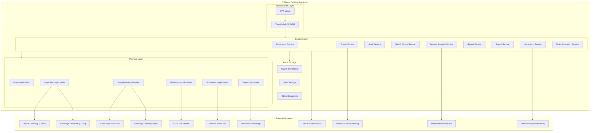
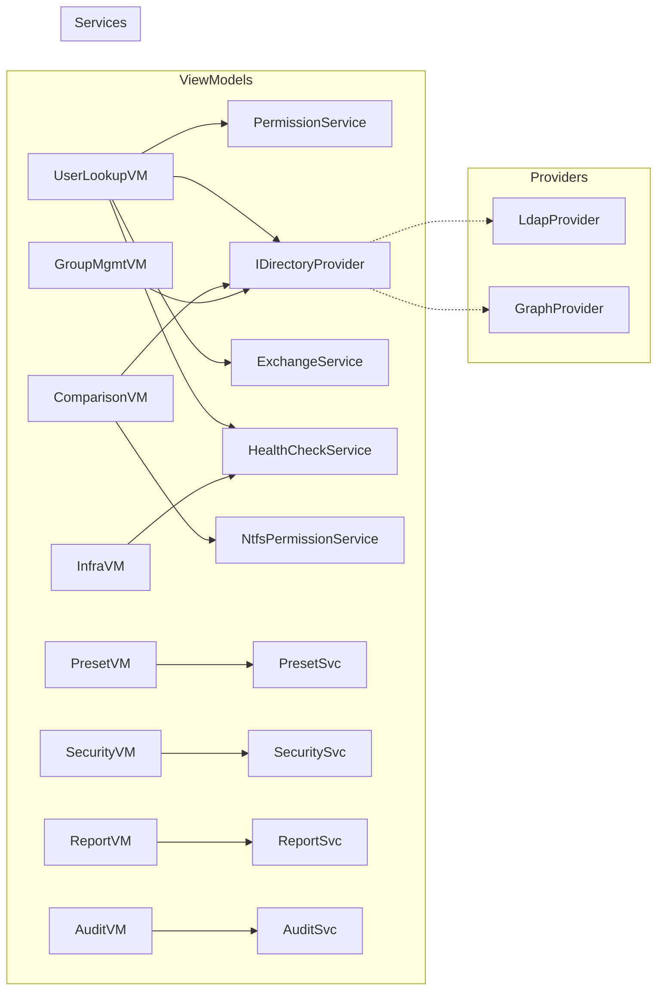
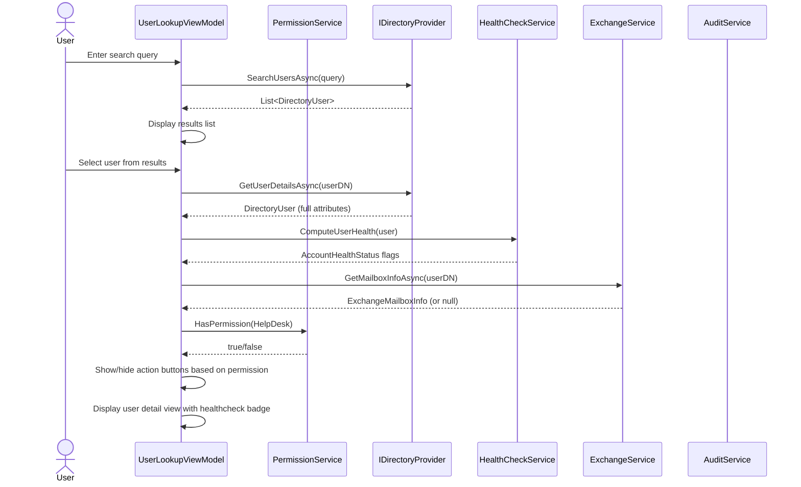
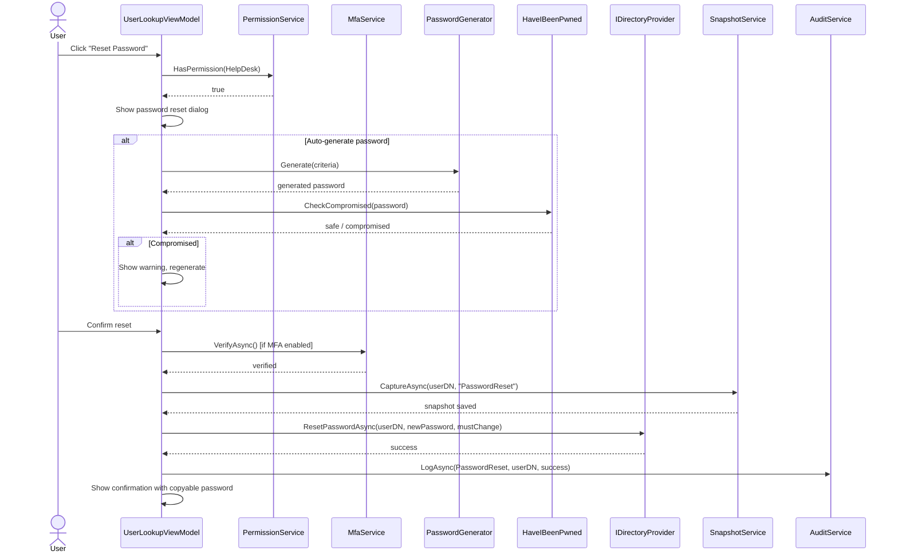
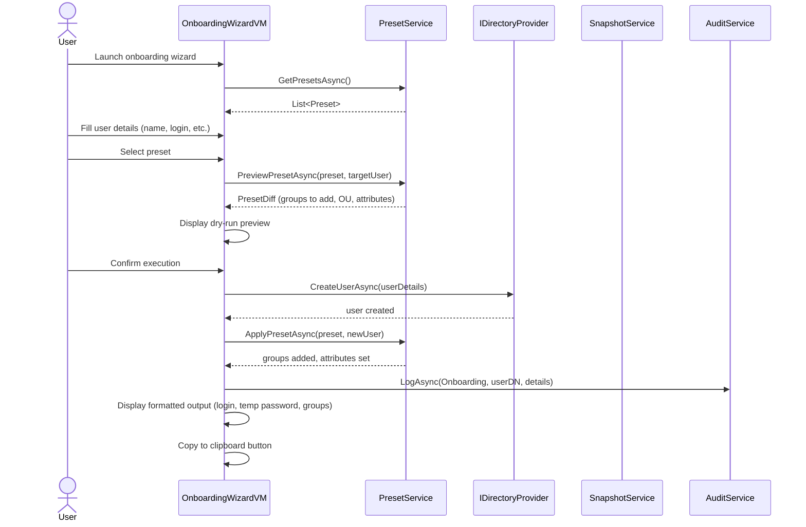
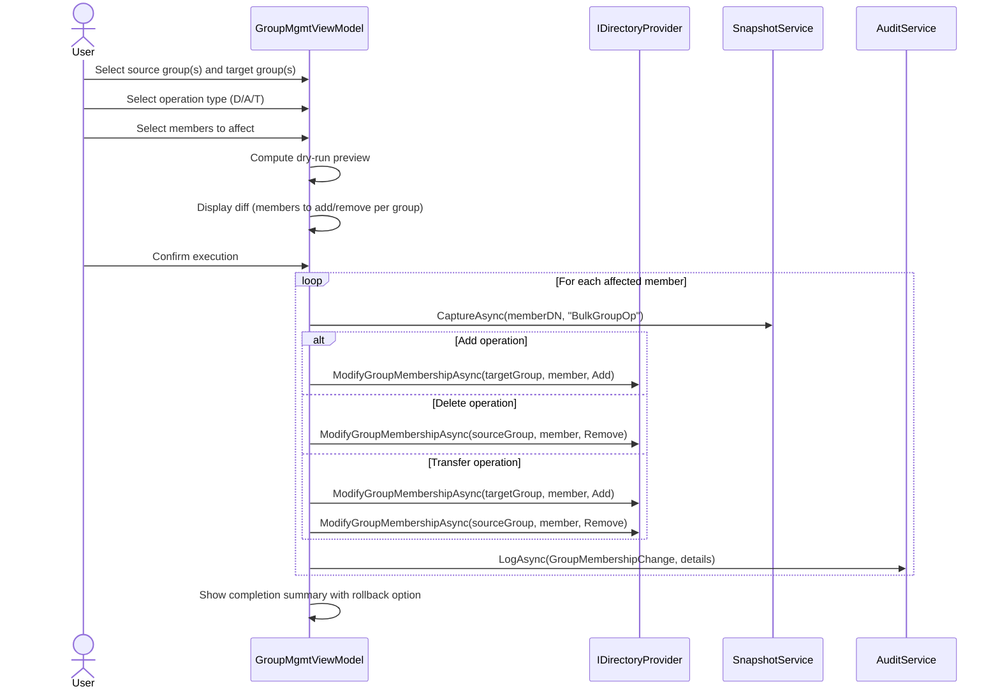

# DSPanel Architecture Document

## Introduction

This document outlines the overall project architecture for DSPanel, including the application structure, services, data models, and non-UI specific concerns. Its primary goal is to serve as the guiding architectural blueprint for AI-driven development, ensuring consistency and adherence to chosen patterns and technologies.

DSPanel is a desktop-only WPF application. There is no separate frontend architecture document - the UI layer is part of this monolithic desktop application and is covered within this document.

### Starter Template or Existing Project

N/A - This is a greenfield project built from scratch using the standard `dotnet new wpf` template with .NET 10. No starter template or existing codebase is used as foundation.

### Change Log

| Date | Version | Description | Author |
|------|---------|-------------|--------|
| 2026-03-10 | 0.1 | Initial architecture document | Romain G. |

---

## High Level Architecture

### Technical Summary

DSPanel is a Windows desktop monolith built with WPF and .NET 10, following the MVVM pattern via CommunityToolkit.Mvvm. The application connects to Active Directory on-prem (via LDAP using System.DirectoryServices.Protocols) and optionally to Entra ID / Exchange Online (via Microsoft Graph SDK), abstracted behind an `IDirectoryProvider` adapter pattern. A permission system detects the current Windows user's AD group memberships at startup and dynamically controls UI visibility. Local storage is limited to audit logs (SQLite), user settings, and object snapshots. Presets are stored externally as JSON files on a configurable network share.

### High Level Overview

1. **Architectural style**: Desktop monolith with internal modular layering (Presentation / Service / Provider)
2. **Repository structure**: Monorepo - single solution containing the WPF app project, test project, and documentation
3. **Service architecture**: Layered architecture within a single process - ViewModels call Services, Services call Providers
4. **Primary user flow**: User launches app - permission level detected - UI adapts - user searches AD objects - views details - performs actions (gated by permission level) - all actions logged
5. **Key decisions**: Adapter pattern for directory abstraction (on-prem vs cloud), permission-based UI gating, external preset storage, local SQLite for audit

### High Level Project Diagram



### Architectural and Design Patterns

- **MVVM (Model-View-ViewModel)**: CommunityToolkit.Mvvm with source generators for ObservableObject and RelayCommand. Rationale: standard WPF pattern, clean separation of UI and logic, enables unit testing of ViewModels without UI.

- **Adapter Pattern (IDirectoryProvider)**: Abstract interface for all directory operations with concrete implementations for LDAP (on-prem) and Graph (cloud). Rationale: enables seamless hybrid support and testability via mocking.

- **Dependency Injection**: Microsoft.Extensions.DependencyInjection with Hosting for app lifecycle. Rationale: standard .NET DI, enables testability, clean service registration, aligns with IDirectoryProvider pattern.

- **Repository Pattern (for local storage)**: SQLite access for audit logs and snapshots abstracted behind interfaces. Rationale: keeps data access testable and swappable.

- **Observer Pattern (for permissions)**: UI elements bind to permission-level observable properties that trigger visibility/enabled state changes. Rationale: reactive UI adaptation without polling or manual refresh.

- **Strategy Pattern (for presets)**: Preset engine selects the appropriate onboarding/offboarding strategy based on preset type. Rationale: extensible workflow execution.

- **Command Pattern**: All write operations are encapsulated as commands with undo capability (object snapshots). Rationale: enables dry-run preview, audit logging, and rollback.

---

## Tech Stack

### Cloud Infrastructure

- **Provider**: N/A - Desktop application, no cloud hosting required
- **Key Services**: Azure AD App Registration (for Microsoft Graph access to Entra ID / Exchange Online)
- **Deployment**: GitHub Releases (MSIX + portable exe)

### Technology Stack Table

| Category | Technology | Version | Purpose | Rationale |
|----------|-----------|---------|---------|-----------|
| **Language** | C# | 13 | Primary development language | Modern C# features (primary constructors, collection expressions, params collections), strong typing, WPF native |
| **Runtime** | .NET | 10.0 (LTS) | Application runtime | Long-term support (Nov 2025 - Nov 2028), Windows desktop support, latest APIs |
| **UI Framework** | WPF | .NET 10 built-in | Desktop UI | Windows-native, rich controls, data binding, MVVM support |
| **MVVM Toolkit** | CommunityToolkit.Mvvm | 8.4.0 | MVVM infrastructure | Source generators, ObservableObject, RelayCommand, Messenger |
| **DI Container** | Microsoft.Extensions.DependencyInjection | 10.0.3 | Dependency injection | Standard .NET DI, lightweight, well-integrated |
| **App Hosting** | Microsoft.Extensions.Hosting | 10.0.3 | Application lifecycle | Startup/shutdown, configuration, logging integration |
| **LDAP** | System.DirectoryServices.Protocols | 10.0.3 | AD on-prem queries | Low-level LDAP control, pagination support, performant |
| **Graph SDK** | Microsoft.Graph | 5.x | Entra ID + Exchange Online | Official Microsoft SDK, typed models, batch support |
| **Graph Auth** | Azure.Identity | 1.13.x | Graph authentication | MSAL integration, device code flow, token caching |
| **Logging** | Serilog | 4.3.1 | Structured logging | Structured output, multiple sinks, enrichers |
| **Logging Sink** | Serilog.Sinks.File | 7.0.0 | File logging | Rolling files, size limits |
| **Logging Sink** | Serilog.Sinks.Console | 6.1.1 | Console logging (debug) | Development diagnostics |
| **Local DB** | Microsoft.Data.Sqlite | 10.0.3 | Audit log + snapshots storage | Lightweight, embedded, no server needed |
| **ORM** | Dapper | 2.1.72 | SQLite data access | Lightweight, fast, minimal abstraction |
| **JSON** | System.Text.Json | Built-in | Preset serialization, settings | Built-in, performant, source generators |
| **PDF Export** | QuestPDF | 2026.2.3 | PDF report generation | Open source (MIT), fluent API, no external dependencies |
| **CSV Export** | CsvHelper | 33.1.0 | CSV export | Robust, handles edge cases (encoding, escaping) |
| **Password Hash** | System.Security.Cryptography | Built-in | SHA1 for HIBP k-anonymity | Built-in, no external dependency needed |
| **HTTP Client** | System.Net.Http | Built-in | HIBP API, GitHub API, webhooks | Built-in HttpClient with IHttpClientFactory pattern |
| **WMI/CIM** | System.Management | 10.0.3 | Remote workstation monitoring | WMI queries for CPU, RAM, services, disks |
| **ACL** | System.Security.AccessControl | Built-in | NTFS permission analysis | Built-in ACL resolution |
| **Testing** | xUnit | 2.9.3 | Unit + integration tests | Modern, extensible, good .NET integration |
| **Mocking** | Moq | 4.20.72 | Test mocking | Interface mocking, setup verification |
| **Test Assertions** | FluentAssertions | 8.8.0 | Readable test assertions | Expressive syntax, better error messages |
| **Code Analysis** | .NET Analyzers | Built-in | Static code analysis | Built-in, catches common issues |

---

## Data Models

### DirectoryUser

**Purpose**: Represents an Active Directory user account with all attributes needed for lookup, healthcheck, comparison, and actions.

**Key Attributes:**
- SamAccountName: string - Primary login identifier
- UserPrincipalName: string - UPN (user@domain.com)
- DisplayName: string - Full display name
- FirstName / LastName: string - Given name and surname
- Email: string - Primary email address
- Department: string - Organizational department
- Title: string - Job title
- DistinguishedName: string - Full DN in AD
- OrganizationalUnit: string - Parent OU path
- IsEnabled: bool - Account enabled/disabled state
- IsLockedOut: bool - Lockout state
- LastLogon: DateTime? - Last authentication timestamp
- LastLogonWorkstation: string? - Last machine name
- PasswordLastSet: DateTime? - Last password change
- AccountExpires: DateTime? - Account expiration date
- PasswordNeverExpires: bool - Password policy flag
- PasswordExpired: bool - Current password state
- BadPasswordCount: int - Failed authentication attempts
- MemberOf: List<string> - Group DNs
- HealthStatus: AccountHealthStatus - Computed health flags
- ThumbnailPhoto: byte[]? - Profile photo

**Relationships:**
- Member of multiple DirectoryGroup objects
- Located in one OrganizationalUnit
- Optionally has ExchangeMailbox info

### DirectoryComputer

**Purpose**: Represents an AD computer account.

**Key Attributes:**
- Name: string - Computer name
- DnsHostName: string - FQDN
- DistinguishedName: string - Full DN
- OrganizationalUnit: string - Parent OU
- OperatingSystem: string - OS name
- OperatingSystemVersion: string - OS version
- IsEnabled: bool - Account state
- LastLogon: DateTime? - Last authentication
- MemberOf: List<string> - Group DNs
- IPv4Address: string? - Resolved IP

**Relationships:**
- Member of multiple DirectoryGroup objects
- Located in one OrganizationalUnit

### DirectoryGroup

**Purpose**: Represents an AD security or distribution group.

**Key Attributes:**
- Name: string - Group name
- DistinguishedName: string - Full DN
- Description: string - Group description
- Scope: GroupScope (DomainLocal, Global, Universal)
- Category: GroupCategory (Security, Distribution)
- Members: List<string> - Member DNs
- MemberOf: List<string> - Parent group DNs
- MemberCount: int - Total member count

**Relationships:**
- Contains multiple DirectoryUser, DirectoryComputer, or nested DirectoryGroup members
- Can be member of other DirectoryGroup objects

### ExchangeMailboxInfo

**Purpose**: Read-only Exchange mailbox diagnostic data (on-prem or online).

**Key Attributes:**
- MailboxName: string - Display name
- PrimarySmtpAddress: string - Primary email
- Aliases: List<string> - All proxy addresses
- ForwardingAddress: string? - Mail forwarding target
- MailboxType: string - Mailbox type (User, Shared, Room)
- QuotaUsed: long? - Current mailbox size
- QuotaLimit: long? - Mailbox quota
- Delegates: List<string> - Delegation entries
- Source: MailboxSource (OnPrem, Online) - Data origin

### Preset

**Purpose**: Declarative template for onboarding/offboarding operations.

**Key Attributes:**
- Id: Guid - Unique identifier
- Name: string - Preset display name
- Description: string - What this preset does
- Type: PresetType (Onboarding, Offboarding)
- TargetRole: string - Role/team this applies to
- TargetOU: string - Default OU for new accounts
- Groups: List<string> - AD group DNs to add/remove
- AdditionalAttributes: Dictionary<string, string> - Extra AD attributes to set
- CreatedBy: string - Creator
- CreatedAt: DateTime - Creation timestamp
- ModifiedAt: DateTime - Last modification

**Relationships:**
- References multiple DirectoryGroup objects
- References one target OrganizationalUnit

### AuditLogEntry

**Purpose**: Internal DSPanel action log entry stored in SQLite.

**Key Attributes:**
- Id: long - Auto-increment ID
- Timestamp: DateTime - When the action occurred
- UserName: string - DSPanel operator (Windows account)
- ActionType: string - Action category (PasswordReset, GroupAdd, etc.)
- TargetObject: string - DN of the affected AD object
- Details: string - JSON serialized action details
- Result: ActionResult (Success, Failure, DryRun)
- ErrorMessage: string? - Error details if failed

### ObjectSnapshot

**Purpose**: Point-in-time capture of an AD object's attributes for backup/restore.

**Key Attributes:**
- Id: long - Auto-increment ID
- Timestamp: DateTime - Snapshot time
- ObjectDN: string - Distinguished name
- ObjectType: string - User, Computer, Group
- OperationType: string - What triggered the snapshot
- Attributes: string - JSON serialized attribute dictionary
- CreatedBy: string - Who triggered the operation

### AutomationRule

**Purpose**: Trigger-based automation rule definition.

**Key Attributes:**
- Id: Guid - Unique identifier
- Name: string - Rule name
- IsEnabled: bool - Active state
- TriggerType: TriggerType - What triggers the rule
- TriggerCondition: string - JSON condition definition
- Actions: List<AutomationAction> - What to execute
- CreatedBy: string - Creator
- LastTriggered: DateTime? - Last execution

---

## Components

### PermissionService

**Responsibility**: Detect current user's AD group memberships at startup and map to a PermissionLevel. Provide HasPermission() for UI binding.

**Key Interfaces:**
- IPermissionService.CurrentLevel: PermissionLevel
- IPermissionService.HasPermission(PermissionLevel required): bool
- IPermissionService.DetectPermissionLevelAsync(): Task

**Dependencies**: IDirectoryProvider (to query current user's groups)

**Technology Stack**: Pure C# service, no external dependencies

### DirectoryProviders

**Responsibility**: Abstract all directory operations behind IDirectoryProvider. Two implementations: LdapDirectoryProvider (on-prem) and GraphDirectoryProvider (Entra ID).

**Key Interfaces:**
- IDirectoryProvider.SearchUsersAsync(string query): Task<List<DirectoryUser>>
- IDirectoryProvider.SearchComputersAsync(string query): Task<List<DirectoryComputer>>
- IDirectoryProvider.GetGroupsAsync(): Task<List<DirectoryGroup>>
- IDirectoryProvider.GetGroupMembersAsync(string groupDN): Task<List<string>>
- IDirectoryProvider.ModifyGroupMembershipAsync(string groupDN, string memberDN, MembershipAction action): Task
- IDirectoryProvider.ResetPasswordAsync(string userDN, string newPassword, bool mustChange): Task
- IDirectoryProvider.UnlockAccountAsync(string userDN): Task
- IDirectoryProvider.SetAccountEnabledAsync(string userDN, bool enabled): Task
- IDirectoryProvider.MoveObjectAsync(string objectDN, string targetOU): Task
- IDirectoryProvider.GetObjectAttributesAsync(string objectDN): Task<Dictionary<string, object>>
- IDirectoryProvider.SetObjectAttributesAsync(string objectDN, Dictionary<string, object> attributes): Task
- IDirectoryProvider.GetDeletedObjectsAsync(): Task<List<DeletedObject>>
- IDirectoryProvider.RestoreDeletedObjectAsync(string objectDN, string targetOU): Task
- ProviderType: DirectoryProviderType (OnPrem, Cloud, Hybrid)

**Dependencies**: System.DirectoryServices.Protocols (LDAP), Microsoft.Graph (Graph)

### ExchangeService

**Responsibility**: Query Exchange mailbox information in read-only mode. Delegates to LDAP msExch* attributes (on-prem) or Graph API (online).

**Key Interfaces:**
- IExchangeService.GetMailboxInfoAsync(string userDN): Task<ExchangeMailboxInfo?>
- IExchangeService.IsExchangeAvailable: bool

**Dependencies**: IDirectoryProvider (for LDAP attributes), Microsoft.Graph (for Exchange Online)

### PresetService

**Responsibility**: Load, validate, save, and execute presets from the configured network share.

**Key Interfaces:**
- IPresetService.GetPresetsAsync(): Task<List<Preset>>
- IPresetService.SavePresetAsync(Preset preset): Task
- IPresetService.DeletePresetAsync(Guid presetId): Task
- IPresetService.PreviewPresetAsync(Preset preset, DirectoryUser targetUser): Task<PresetDiff>
- IPresetService.ApplyPresetAsync(Preset preset, DirectoryUser targetUser): Task<PresetResult>

**Dependencies**: IDirectoryProvider, file system access to network share

### AuditService

**Responsibility**: Log all DSPanel actions to local SQLite database. Provide query/search/export capabilities.

**Key Interfaces:**
- IAuditService.LogAsync(AuditLogEntry entry): Task
- IAuditService.SearchAsync(AuditSearchCriteria criteria): Task<List<AuditLogEntry>>
- IAuditService.ExportAsync(AuditSearchCriteria criteria, ExportFormat format): Task<byte[]>

**Dependencies**: Microsoft.Data.Sqlite, Dapper

### SnapshotService

**Responsibility**: Capture AD object state before modifications and restore from snapshots.

**Key Interfaces:**
- ISnapshotService.CaptureAsync(string objectDN, string operationType): Task<ObjectSnapshot>
- ISnapshotService.GetSnapshotsAsync(string objectDN): Task<List<ObjectSnapshot>>
- ISnapshotService.RestoreAsync(long snapshotId): Task
- ISnapshotService.CleanupAsync(int retentionDays): Task

**Dependencies**: IDirectoryProvider, Microsoft.Data.Sqlite

### HealthCheckService

**Responsibility**: Compute account healthcheck badges and domain-wide health status.

**Key Interfaces:**
- IHealthCheckService.ComputeUserHealth(DirectoryUser user): AccountHealthStatus
- IHealthCheckService.GetDCHealthAsync(): Task<List<DCHealthStatus>>
- IHealthCheckService.GetReplicationStatusAsync(): Task<List<ReplicationStatus>>
- IHealthCheckService.CheckDnsHealthAsync(): Task<DnsHealthReport>
- IHealthCheckService.CheckKerberosClockAsync(): Task<ClockSkewReport>

**Dependencies**: IDirectoryProvider, DNS resolver, WMI provider

### SecurityAnalysisService

**Responsibility**: Compute domain risk score, detect AD attacks from event logs, and analyze privilege escalation paths.

**Key Interfaces:**
- ISecurityAnalysisService.ComputeRiskScoreAsync(): Task<RiskScoreReport>
- ISecurityAnalysisService.GetPrivilegedAccountsAsync(): Task<List<PrivilegedAccountInfo>>
- ISecurityAnalysisService.DetectAttacksAsync(): Task<List<SecurityAlert>>
- ISecurityAnalysisService.GetEscalationPathsAsync(): Task<EscalationGraph>

**Dependencies**: IDirectoryProvider, EventLogProvider

### NtfsPermissionService

**Responsibility**: Resolve NTFS ACLs on UNC paths and cross-reference with AD group memberships.

**Key Interfaces:**
- INtfsPermissionService.GetPermissionsAsync(string uncPath): Task<List<AclEntry>>
- INtfsPermissionService.AnalyzeUserAccessAsync(string uncPath, string userDN): Task<AccessAnalysis>
- INtfsPermissionService.CompareUserAccessAsync(string uncPath, string userDN1, string userDN2): Task<AccessComparison>

**Dependencies**: System.Security.AccessControl, IDirectoryProvider

### WmiMonitoringService

**Responsibility**: Query remote workstation status via WMI/CIM.

**Key Interfaces:**
- IWmiMonitoringService.GetSystemInfoAsync(string computerName): Task<SystemInfo>
- IWmiMonitoringService.GetRunningServicesAsync(string computerName): Task<List<ServiceInfo>>
- IWmiMonitoringService.GetActiveSessionsAsync(string computerName): Task<List<SessionInfo>>

**Dependencies**: System.Management

### ReportService

**Responsibility**: Generate scheduled and on-demand reports.

**Key Interfaces:**
- IReportService.GenerateReportAsync(ReportType type, ReportParameters parameters): Task<ReportResult>
- IReportService.ScheduleReportAsync(ScheduledReport schedule): Task
- IReportService.GetScheduledReportsAsync(): Task<List<ScheduledReport>>

**Dependencies**: IDirectoryProvider, ExportService

### ExportService

**Responsibility**: Export data to CSV and PDF formats.

**Key Interfaces:**
- IExportService.ExportToCsvAsync<T>(IEnumerable<T> data, string filePath): Task
- IExportService.ExportToPdfAsync(ReportResult report, string filePath): Task

**Dependencies**: CsvHelper, QuestPDF

### NotificationService

**Responsibility**: Send webhook notifications to Teams, Slack, or email.

**Key Interfaces:**
- INotificationService.SendAsync(NotificationEvent event): Task
- INotificationService.TestChannelAsync(NotificationChannel channel): Task<bool>

**Dependencies**: HttpClient

### NavigationService

**Responsibility**: Manage view navigation in the WPF shell (sidebar, tabs, dialogs).

**Key Interfaces:**
- INavigationService.NavigateTo<TViewModel>(object? parameter): void
- INavigationService.OpenTab<TViewModel>(object? parameter): void
- INavigationService.ShowDialog<TViewModel>(object? parameter): Task<bool?>

**Dependencies**: WPF Dispatcher, DI container

### Component Diagram



---

## External APIs

### Active Directory (LDAP)

- **Purpose**: Primary data source for all AD on-prem operations
- **Authentication**: Kerberos (current Windows user credentials, no stored passwords)
- **Rate Limits**: None (on-prem infrastructure)

**Key Operations:**
- `SearchRequest` with LDAP filters for user/computer/group lookups
- `ModifyRequest` for attribute changes, group membership modifications
- `AddRequest` for object creation (onboarding)
- `DeleteRequest` for object deletion
- `ModifyDNRequest` for moving objects between OUs

**Integration Notes**: Use paged results (PageResultRequestControl) for queries returning 1000+ results. Always use LDAP over SSL (port 636) when available. Connection pooling via LdapConnection reuse.

### Microsoft Graph API

- **Purpose**: Entra ID directory operations and Exchange Online diagnostics
- **Documentation**: https://learn.microsoft.com/en-us/graph/api/overview
- **Base URL**: https://graph.microsoft.com/v1.0
- **Authentication**: OAuth 2.0 via Azure AD App Registration (device code flow for desktop)
- **Rate Limits**: Per-tenant throttling (varies by endpoint)

**Key Endpoints Used:**
- `GET /users/{id}` - User profile and attributes
- `GET /users/{id}/memberOf` - Group memberships
- `GET /users/{id}/mailboxSettings` - Exchange Online mailbox settings
- `GET /users/{id}/messages` - Mail diagnostics (if permitted)
- `GET /groups` - Group listing
- `GET /users/{id}/mailFolders` - Mailbox quota info

**Integration Notes**: Requires Azure AD App Registration with Directory.Read.All and Mail.Read delegated permissions minimum. Use batch requests ($batch) for multiple queries. Handle 429 (throttled) responses with retry-after header.

### HaveIBeenPwned API

- **Purpose**: Check generated passwords against known compromised passwords
- **Documentation**: https://haveibeenpwned.com/API/v3#PwnedPasswords
- **Base URL**: https://api.pwnedpasswords.com
- **Authentication**: None (k-anonymity model)
- **Rate Limits**: Generous, no API key required for password range endpoint

**Key Endpoints Used:**
- `GET /range/{first5HashChars}` - Get all password hashes matching the first 5 characters of the SHA1 hash

**Integration Notes**: Only the first 5 characters of the SHA1 hash are sent (k-anonymity). Response is compared locally. Must work offline (skip check with warning if unreachable).

### GitHub Releases API

- **Purpose**: Check for application updates at startup
- **Base URL**: https://api.github.com
- **Authentication**: None (public repo)
- **Rate Limits**: 60 requests/hour unauthenticated

**Key Endpoints Used:**
- `GET /repos/Rwx-G/DSPanel/releases/latest` - Get latest release version and download URL

---

## Core Workflows

### User Lookup Workflow



### Password Reset Workflow



### Onboarding Wizard Workflow



### Bulk Group Operation Workflow



---

## Database Schema

DSPanel uses SQLite for local-only storage (audit log, snapshots, settings). No server database.

```sql
-- Audit Log
CREATE TABLE audit_log (
    id INTEGER PRIMARY KEY AUTOINCREMENT,
    timestamp TEXT NOT NULL DEFAULT (datetime('now')),
    user_name TEXT NOT NULL,
    action_type TEXT NOT NULL,
    target_object TEXT,
    details TEXT,  -- JSON
    result TEXT NOT NULL CHECK (result IN ('Success', 'Failure', 'DryRun')),
    error_message TEXT
);

CREATE INDEX idx_audit_timestamp ON audit_log(timestamp);
CREATE INDEX idx_audit_user ON audit_log(user_name);
CREATE INDEX idx_audit_action ON audit_log(action_type);
CREATE INDEX idx_audit_target ON audit_log(target_object);

-- Object Snapshots
CREATE TABLE object_snapshots (
    id INTEGER PRIMARY KEY AUTOINCREMENT,
    timestamp TEXT NOT NULL DEFAULT (datetime('now')),
    object_dn TEXT NOT NULL,
    object_type TEXT NOT NULL,
    operation_type TEXT NOT NULL,
    attributes TEXT NOT NULL,  -- JSON
    created_by TEXT NOT NULL
);

CREATE INDEX idx_snapshot_dn ON object_snapshots(object_dn);
CREATE INDEX idx_snapshot_timestamp ON object_snapshots(timestamp);

-- Scheduled Reports
CREATE TABLE scheduled_reports (
    id TEXT PRIMARY KEY,  -- GUID
    name TEXT NOT NULL,
    report_type TEXT NOT NULL,
    parameters TEXT NOT NULL,  -- JSON
    frequency TEXT NOT NULL,  -- daily/weekly/monthly
    output_format TEXT NOT NULL,
    output_path TEXT,
    last_run TEXT,
    next_run TEXT,
    is_enabled INTEGER NOT NULL DEFAULT 1,
    created_by TEXT NOT NULL
);

-- Automation Rules
CREATE TABLE automation_rules (
    id TEXT PRIMARY KEY,  -- GUID
    name TEXT NOT NULL,
    is_enabled INTEGER NOT NULL DEFAULT 1,
    trigger_type TEXT NOT NULL,
    trigger_condition TEXT NOT NULL,  -- JSON
    actions TEXT NOT NULL,  -- JSON
    created_by TEXT NOT NULL,
    last_triggered TEXT
);

-- Notification Channels
CREATE TABLE notification_channels (
    id TEXT PRIMARY KEY,  -- GUID
    name TEXT NOT NULL,
    channel_type TEXT NOT NULL,  -- Webhook, SMTP
    configuration TEXT NOT NULL,  -- JSON (URL, credentials)
    is_enabled INTEGER NOT NULL DEFAULT 1
);

-- Risk Score History
CREATE TABLE risk_score_history (
    id INTEGER PRIMARY KEY AUTOINCREMENT,
    timestamp TEXT NOT NULL DEFAULT (datetime('now')),
    total_score INTEGER NOT NULL,
    factor_scores TEXT NOT NULL  -- JSON
);
```

---

## Source Tree

```
DSPanel/
  .github/
    workflows/
      build.yml                      # CI: build + test on push/PR
      release.yml                    # CD: build MSIX + portable on tag
    ISSUE_TEMPLATE/
      bug_report.md
      feature_request.md
  docs/
    brainstorming-session-results.md
    brief.md
    prd.md
    architecture.md                  # This document
    architecture/                    # Sharded architecture docs
      01-tech-stack.md
      02-data-models.md
      03-components.md
      04-source-tree.md
      05-coding-standards.md
    stories/                         # User stories for development
  src/
    DSPanel/
      App.xaml
      App.xaml.cs
      MainWindow.xaml
      MainWindow.xaml.cs
      DSPanel.csproj
      Converters/                    # WPF value converters
        BoolToVisibilityConverter.cs
        PermissionLevelConverter.cs
        HealthStatusToColorConverter.cs
      Helpers/                       # Utility classes
        LdapHelpers.cs
        DnParser.cs
      Models/                        # Domain models (POCOs)
        DirectoryUser.cs
        DirectoryComputer.cs
        DirectoryGroup.cs
        ExchangeMailboxInfo.cs
        AccountHealthStatus.cs
        Preset.cs
        AuditLogEntry.cs
        ObjectSnapshot.cs
        AutomationRule.cs
        RiskScoreReport.cs
        SecurityAlert.cs
      Services/                      # Business logic services
        Directory/
          IDirectoryProvider.cs
          LdapDirectoryProvider.cs
          GraphDirectoryProvider.cs
          DirectoryProviderFactory.cs
        Exchange/
          IExchangeService.cs
          ExchangeService.cs
        Permissions/
          IPermissionService.cs
          PermissionService.cs
          PermissionLevel.cs
        Presets/
          IPresetService.cs
          PresetService.cs
          PresetValidator.cs
        Audit/
          IAuditService.cs
          AuditService.cs
        Snapshots/
          ISnapshotService.cs
          SnapshotService.cs
        Health/
          IHealthCheckService.cs
          HealthCheckService.cs
        Security/
          ISecurityAnalysisService.cs
          SecurityAnalysisService.cs
          RiskScoreCalculator.cs
          AttackDetector.cs
        Ntfs/
          INtfsPermissionService.cs
          NtfsPermissionService.cs
        Monitoring/
          IWmiMonitoringService.cs
          WmiMonitoringService.cs
        Reports/
          IReportService.cs
          ReportService.cs
        Export/
          IExportService.cs
          CsvExportService.cs
          PdfExportService.cs
        Notifications/
          INotificationService.cs
          NotificationService.cs
          WebhookSender.cs
        Scripts/
          IScriptExecutionService.cs
          ScriptExecutionService.cs
        Navigation/
          INavigationService.cs
          NavigationService.cs
        Update/
          IUpdateService.cs
          UpdateService.cs
        Mfa/
          IMfaService.cs
          TotpMfaService.cs
        Password/
          IPasswordService.cs
          PasswordGenerator.cs
          HibpClient.cs
      ViewModels/                    # MVVM ViewModels
        MainViewModel.cs
        UserLookupViewModel.cs
        ComputerLookupViewModel.cs
        ComparisonViewModel.cs
        GroupManagementViewModel.cs
        PresetManagementViewModel.cs
        OnboardingWizardViewModel.cs
        OffboardingViewModel.cs
        InfrastructureHealthViewModel.cs
        SecurityDashboardViewModel.cs
        ReportsViewModel.cs
        AuditLogViewModel.cs
        SettingsViewModel.cs
        Dialogs/
          PasswordResetDialogViewModel.cs
          MfaDialogViewModel.cs
          DryRunPreviewDialogViewModel.cs
          PresetEditorDialogViewModel.cs
      Views/                         # WPF Views (XAML)
        MainWindow.xaml(.cs)
        Controls/
          SearchBar.xaml(.cs)
          HealthBadge.xaml(.cs)
          PermissionGate.xaml(.cs)
          GroupTreeView.xaml(.cs)
          DiffViewer.xaml(.cs)
        Pages/
          UserLookupView.xaml(.cs)
          ComputerLookupView.xaml(.cs)
          ComparisonView.xaml(.cs)
          GroupManagementView.xaml(.cs)
          PresetManagementView.xaml(.cs)
          OnboardingWizardView.xaml(.cs)
          OffboardingView.xaml(.cs)
          InfrastructureHealthView.xaml(.cs)
          SecurityDashboardView.xaml(.cs)
          ReportsView.xaml(.cs)
          AuditLogView.xaml(.cs)
          SettingsView.xaml(.cs)
        Dialogs/
          PasswordResetDialog.xaml(.cs)
          MfaDialog.xaml(.cs)
          DryRunPreviewDialog.xaml(.cs)
          PresetEditorDialog.xaml(.cs)
      Resources/
        Styles/
          Colors.xaml
          DarkTheme.xaml
          LightTheme.xaml
          Controls.xaml
        Icons/
          dspanel.ico
      Data/                          # SQLite database access
        DatabaseInitializer.cs
        AuditRepository.cs
        SnapshotRepository.cs
        SettingsRepository.cs
    DSPanel.Tests/
      DSPanel.Tests.csproj
      Services/
        Directory/
          LdapDirectoryProviderTests.cs
          GraphDirectoryProviderTests.cs
        Permissions/
          PermissionServiceTests.cs
        Presets/
          PresetServiceTests.cs
          PresetValidatorTests.cs
        Health/
          HealthCheckServiceTests.cs
        Security/
          RiskScoreCalculatorTests.cs
          AttackDetectorTests.cs
        Ntfs/
          NtfsPermissionServiceTests.cs
        Password/
          PasswordGeneratorTests.cs
          HibpClientTests.cs
        Export/
          CsvExportServiceTests.cs
      ViewModels/
        UserLookupViewModelTests.cs
        ComparisonViewModelTests.cs
        GroupManagementViewModelTests.cs
      Helpers/
        DnParserTests.cs
      TestHelpers/
        MockDirectoryProvider.cs
        TestDataBuilder.cs
  .gitignore
  .editorconfig
  CHANGELOG.md
  LICENSE
  README.md
  DSPanel.sln
```

---

## Infrastructure and Deployment

### Infrastructure as Code

- **Tool**: N/A - Desktop application, no cloud infrastructure to provision
- **CI/CD only**: GitHub Actions for build, test, and release packaging

### Deployment Strategy

- **Strategy**: GitHub Releases with manual trigger on version tags
- **CI/CD Platform**: GitHub Actions
- **Pipeline Configuration**: `.github/workflows/`
- **Artifacts**: MSIX package (signed) + portable exe (zip)

### Environments

- **Development**: Local developer machine with AD test domain
- **CI**: GitHub Actions runner (Windows) - build + unit tests only
- **Release**: GitHub Releases - tagged builds produce downloadable artifacts

### Environment Promotion Flow

```
feature branch --> PR --> main (CI: build + test)
                                  |
                          tag vX.Y.Z --> Release workflow
                                  |
                          GitHub Release (MSIX + portable zip)
```

### Rollback Strategy

- **Primary Method**: Users download previous version from GitHub Releases
- **Trigger Conditions**: Critical bug in released version
- **Recovery Time Objective**: Immediate (previous versions always available on GitHub)

---

## Error Handling Strategy

### General Approach

- **Error Model**: Exception-based with custom exception hierarchy
- **Exception Hierarchy**: DSPanelException (base) -> DirectoryException, PermissionDeniedException, PresetValidationException, ExportException, NetworkException
- **Error Propagation**: Services throw typed exceptions. ViewModels catch and display user-friendly messages. Unhandled exceptions caught by global handler.

### Logging Standards

- **Library**: Serilog 4.x
- **Format**: Structured JSON to file, plain text to console (debug only)
- **Levels**: Verbose (trace), Debug (development), Information (operations), Warning (recoverable issues), Error (failures), Fatal (app crash)
- **Required Context**:
    - Operation context: current action type (Lookup, PasswordReset, GroupModify, etc.)
    - User context: current Windows username (never log passwords or tokens)
    - Target context: AD object DN being operated on

### Error Handling Patterns

#### External API Errors

- **Retry Policy**: Exponential backoff (1s, 2s, 4s) with max 3 retries for transient failures (network timeout, 429, 503)
- **Circuit Breaker**: After 5 consecutive failures to a provider, disable that provider and show status bar warning
- **Timeout Configuration**: LDAP queries 30s, Graph API 15s, HIBP 5s, WMI 10s
- **Error Translation**: All external errors wrapped in typed DSPanelExceptions with user-friendly messages

#### Business Logic Errors

- **Custom Exceptions**: PermissionDeniedException, ObjectNotFoundException, PresetValidationException, SnapshotNotFoundException
- **User-Facing Errors**: Displayed in a notification bar (non-modal) with severity icon (info/warning/error)
- **Error Codes**: Not used - exception types are sufficient for a desktop app

#### Data Consistency

- **Transaction Strategy**: SQLite transactions for audit log batch writes
- **Compensation Logic**: Object snapshots enable rollback of AD modifications
- **Idempotency**: Group membership operations check current state before applying

---

## Coding Standards

### Core Standards

- **Language**: C# 13, .NET 10.0
- **Style & Linting**: .editorconfig with .NET default rules, `dotnet format` for enforcement
- **Test Organization**: Mirror source tree (src/DSPanel/Services/Foo.cs -> src/DSPanel.Tests/Services/FooTests.cs)

### Naming Conventions

| Element | Convention | Example |
|---------|-----------|---------|
| Interfaces | I-prefix | `IDirectoryProvider` |
| Async methods | Async suffix | `SearchUsersAsync` |
| Private fields | _camelCase | `_permissionService` |
| Constants | PascalCase | `MaxRetryCount` |
| XAML resources | PascalCase keys | `PrimaryButtonStyle` |

### Critical Rules

- **No blocking calls on UI thread**: All AD/network operations must use async/await. Never use .Result or .Wait() on the UI thread.
- **Always use IDirectoryProvider**: Never instantiate LdapConnection or GraphServiceClient directly in ViewModels or Services. Always go through the provider abstraction.
- **Permission check before action**: Every write operation must call HasPermission() before executing. Never rely solely on UI visibility for security.
- **Snapshot before modify**: Every write operation on AD objects must call SnapshotService.CaptureAsync() before the modification.
- **Audit every write**: Every successful or failed write operation must be logged via AuditService.LogAsync().
- **No secrets in code or logs**: Never log passwords, tokens, or credentials. Never hardcode connection strings or API keys.
- **Dispose LDAP connections**: LdapConnection must be properly disposed. Use `using` statements or connection pooling.
- **Null-check AD attributes**: AD attributes may be null or missing. Always handle null when reading from SearchResultEntry.

### C# Specifics

- **Nullable reference types**: Enabled project-wide. No suppression operators (!.) unless justified with comment.
- **Primary constructors**: Use for DI injection in services and ViewModels.
- **Collection expressions**: Prefer `[]` over `new List<T>()` for initialization.
- **File-scoped namespaces**: Use `namespace DSPanel.Services;` (not block-scoped).
- **Records**: Use for immutable data transfer objects (DTOs, report results).

---

## Test Strategy and Standards

### Testing Philosophy

- **Approach**: Test-after for initial development, test-driven for bug fixes
- **Coverage Goals**: 90%+ on core services, best-effort on ViewModels
- **Test Pyramid**: Heavy unit tests, selective integration tests, manual UI tests

### Test Types and Organization

#### Unit Tests

- **Framework**: xUnit 2.9.x
- **File Convention**: `{ClassName}Tests.cs` in mirrored directory
- **Location**: `src/DSPanel.Tests/`
- **Mocking Library**: Moq 4.20.x
- **Coverage Requirement**: 90%+ on Services/, best-effort on ViewModels/

**AI Agent Requirements:**
- Generate tests for all public methods
- Cover edge cases and error conditions
- Follow AAA pattern (Arrange, Act, Assert)
- Mock all external dependencies (IDirectoryProvider, file system, network)
- Use FluentAssertions for readable assertions

#### Integration Tests

- **Scope**: Optional - for developers with access to an AD test domain
- **Location**: `src/DSPanel.Tests/Integration/`
- **Test Infrastructure**:
    - **LDAP**: Real AD test domain (not mocked) - run only locally, excluded from CI
    - **SQLite**: In-memory SQLite for audit/snapshot repository tests

#### End-to-End Tests

- **Framework**: Manual testing
- **Scope**: Full user workflows (lookup, reset, onboarding, bulk ops)
- **Environment**: Developer machine connected to AD test domain

### Test Data Management

- **Strategy**: Builder pattern for test data
- **Fixtures**: TestDataBuilder class creates DirectoryUser, DirectoryGroup, Preset instances
- **Factories**: MockDirectoryProvider returns configurable test data
- **Cleanup**: In-memory SQLite databases auto-dispose after each test

### Continuous Testing

- **CI Integration**: GitHub Actions runs `dotnet test` on every push/PR (unit tests only)
- **Performance Tests**: Manual benchmarking for LDAP query performance on large domains
- **Security Tests**: Manual review of permission gating and input validation

---

## Security

### Input Validation

- **Validation Library**: Built-in .NET data annotations + custom validators
- **Validation Location**: Service layer (before any AD operation)
- **Required Rules:**
    - All user search inputs sanitized for LDAP injection (escape special chars: `*`, `(`, `)`, `\`, NUL)
    - UNC paths validated for format and accessible characters
    - Preset JSON validated against schema before loading
    - Script paths validated against allowed script directory

### Authentication & Authorization

- **Auth Method**: Windows Integrated Authentication (Kerberos) - no stored credentials
- **Session Management**: Application-lifetime session, permission level cached at startup
- **Required Patterns:**
    - IPermissionService.HasPermission() checked at service layer before every write operation
    - UI elements bound to permission level for visibility (defense in depth, not sole control)
    - MFA challenge (TOTP) configurable for sensitive operations

### Secrets Management

- **Development**: No secrets needed (Kerberos auth uses current Windows credentials)
- **Graph API**: Azure AD App Registration credentials stored in Windows Credential Manager (not plaintext)
- **Code Requirements:**
    - NEVER hardcode secrets, tokens, or passwords
    - Access Graph credentials via Windows Credential Manager API
    - No secrets in logs, error messages, or snapshots

### Data Protection

- **Encryption at Rest**: SQLite database not encrypted (contains only operational logs, no sensitive data). Passwords are never stored.
- **Encryption in Transit**: LDAPS (port 636) for AD communication. HTTPS for all external API calls (Graph, HIBP, GitHub).
- **PII Handling**: AD user data displayed in-memory only, never cached to disk except in audit logs (action metadata only, not full user records)
- **Logging Restrictions**: Never log passwords (old or new), authentication tokens, thumbnail photo data, or full LDAP query results

### Dependency Security

- **Scanning Tool**: `dotnet list package --vulnerable` in CI pipeline
- **Update Policy**: Monthly dependency review, immediate update for critical CVEs
- **Approval Process**: New NuGet packages require justification in PR description

### Security Testing

- **SAST Tool**: .NET Analyzers (built-in) + security-focused rules
- **DAST Tool**: N/A (desktop application, not web)
- **Penetration Testing**: Manual review of LDAP injection vectors and permission bypass scenarios

---

## Next Steps

### Architect Prompt (Frontend/UI)

DSPanel is a desktop WPF application - there is no separate frontend. The UI architecture is embedded within this document (MVVM pattern, Views, ViewModels, navigation service). Proceed directly to story implementation.

### Development Start

Review the PRD (docs/prd.md) Epic 1 stories and begin implementation following this architecture document. Key files to create first:
1. Project skeleton with DI and hosting (Story 1.1)
2. IDirectoryProvider interface and LDAP implementation (Story 1.2)
3. PermissionService (Story 1.3)
4. UserLookupViewModel and View (Story 1.4)
