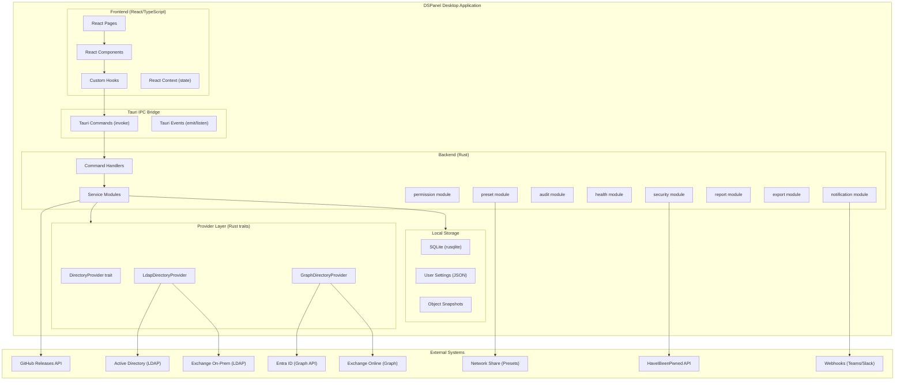
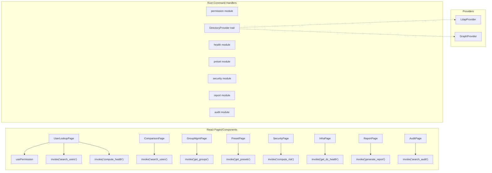
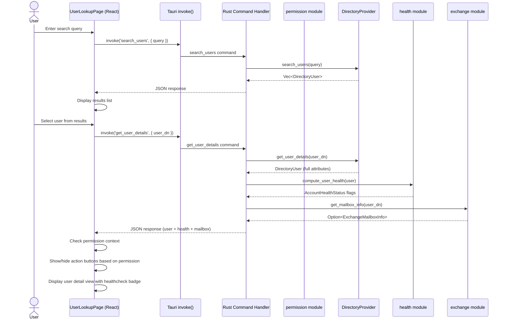
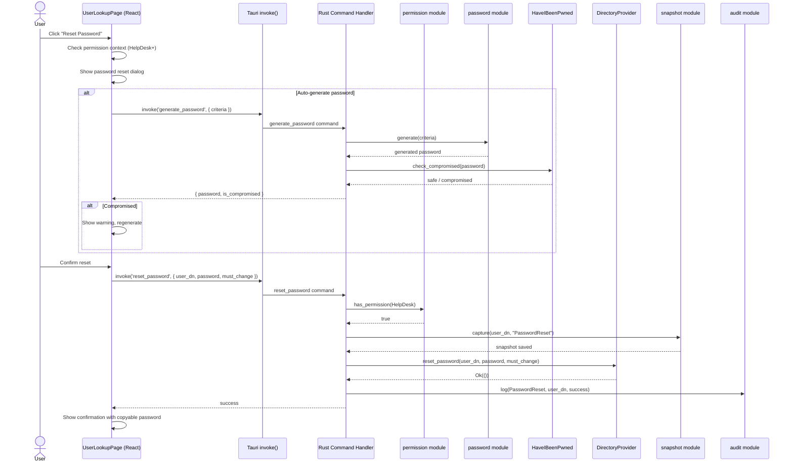
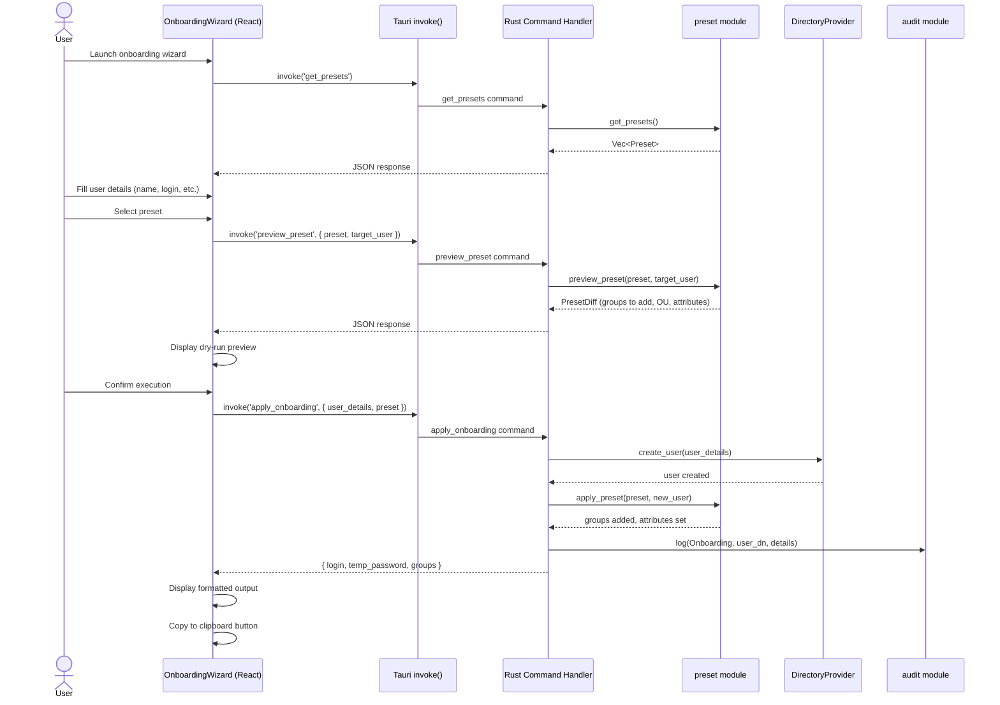
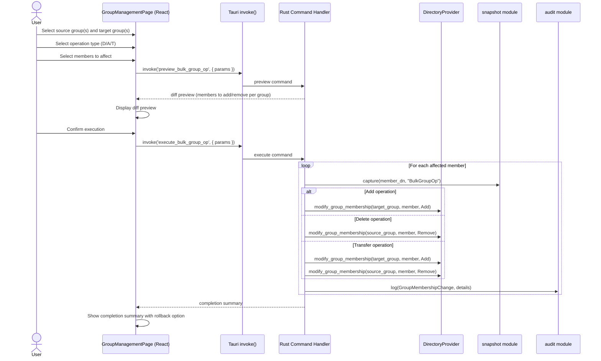

# DSPanel Architecture Document

## Introduction

This document outlines the overall project architecture for DSPanel, including the application structure, services, data models, and non-UI specific concerns. Its primary goal is to serve as the guiding architectural blueprint for AI-driven development, ensuring consistency and adherence to chosen patterns and technologies.

DSPanel is a cross-platform desktop application built with Tauri v2 (Rust backend) and React/TypeScript (frontend). The Rust backend handles all system-level operations (LDAP, file I/O, database) while the React frontend provides the user interface, communicating via Tauri's IPC command system.

### Starter Template or Existing Project

N/A - This is a greenfield project scaffolded with `cargo create-tauri-app` using the React/TypeScript template with Vite bundler. No starter template or existing codebase is used as foundation.

### Change Log

| Date       | Version | Description                                   | Author    |
| ---------- | ------- | --------------------------------------------- | --------- |
| 2026-03-10 | 0.1     | Initial architecture document                 | Romain G. |
| 2026-03-13 | 0.2     | Migration to Rust/Tauri v2 + React/TypeScript | Romain G. |

---

## High Level Architecture

### Technical Summary

DSPanel is a cross-platform desktop application built with Tauri v2, using a Rust backend and a React/TypeScript frontend. The Rust backend connects to Active Directory on-prem (via LDAP using the ldap3 crate) and optionally to Entra ID / Exchange Online (via Microsoft Graph REST API using reqwest), abstracted behind a `DirectoryProvider` trait. A permission system detects the current user's AD group memberships at startup and dynamically controls UI visibility via React context. Local storage is limited to audit logs (SQLite via rusqlite), user settings, and object snapshots. Presets are stored externally as JSON files on a configurable network share.

### High Level Overview

1. **Architectural style**: Tauri hybrid app with Rust backend (system operations) and React frontend (UI), connected via IPC commands
2. **Repository structure**: Monorepo - `src-tauri/` for Rust backend, `src/` for React/TypeScript frontend, and documentation
3. **Service architecture**: Frontend components invoke Tauri commands, which delegate to Rust service modules and provider traits
4. **Primary user flow**: User launches app - permission level detected - UI adapts - user searches AD objects - views details - performs actions (gated by permission level) - all actions logged
5. **Key decisions**: Trait-based adapter pattern for directory abstraction (on-prem vs cloud), permission-based UI gating, external preset storage, local SQLite for audit

### High Level Project Diagram



### Architectural and Design Patterns

- **Component Architecture + Tauri Commands**: React components with hooks for state management, invoking Rust backend via Tauri's `invoke()` IPC. Rationale: clean separation of UI and system logic, type-safe IPC boundary, enables independent testing of both layers.

- **Adapter Pattern (DirectoryProvider trait)**: Rust trait for all directory operations with concrete implementations for LDAP (on-prem) and Graph (cloud). Rationale: enables seamless hybrid support and testability via mock implementations.

- **Dependency Injection (Rust state)**: Tauri's managed state (`app.manage()`) for sharing service instances across commands. Rationale: simple, built-in to Tauri, no external DI framework needed.

- **Repository Pattern (for local storage)**: SQLite access for audit logs and snapshots abstracted behind Rust traits. Rationale: keeps data access testable and swappable.

- **Observer Pattern (for permissions)**: React context provides permission level to the component tree, triggering re-renders when permissions change. Rationale: reactive UI adaptation without polling or manual refresh.

- **Strategy Pattern (for presets)**: Preset engine selects the appropriate onboarding/offboarding strategy based on preset type. Rationale: extensible workflow execution.

- **Command Pattern**: All write operations are encapsulated as commands with undo capability (object snapshots). Rationale: enables dry-run preview, audit logging, and rollback.

---

## Tech Stack

### Cloud Infrastructure

- **Provider**: N/A - Desktop application, no cloud hosting required
- **Key Services**: Azure AD App Registration (for Microsoft Graph access to Entra ID / Exchange Online)
- **Deployment**: GitHub Releases (.msi for Windows, .dmg for macOS, .AppImage/.deb for Linux)

### Technology Stack Table

| Category                   | Technology            | Version        | Purpose                                      | Rationale                                                       |
| -------------------------- | --------------------- | -------------- | -------------------------------------------- | --------------------------------------------------------------- |
| **Backend Language**       | Rust                  | 1.85+ (stable) | Backend logic, system operations             | Memory safety, performance, strong type system, no GC           |
| **Frontend Language**      | TypeScript            | 5.x            | Frontend UI development                      | Type safety, excellent React integration, developer tooling     |
| **Desktop Framework**      | Tauri                 | 2.x            | Desktop app shell, IPC bridge                | Small binary size, native webview, Rust backend, cross-platform |
| **UI Framework**           | React                 | 18.x           | Frontend component framework                 | Component model, hooks, large ecosystem, mature tooling         |
| **Bundler**                | Vite                  | 6.x            | Frontend build tool                          | Fast HMR, native ESM, optimized builds                          |
| **LDAP**                   | ldap3                 | 0.11.x         | AD on-prem queries (Rust)                    | Pure Rust LDAP client, async, TLS support                       |
| **HTTP Client**            | reqwest               | 0.12.x         | Graph API, HIBP, GitHub API, webhooks (Rust) | Async HTTP, TLS, connection pooling, widely used                |
| **Logging**                | tracing               | 0.1.x          | Structured logging (Rust)                    | Structured spans, multiple subscribers, async-aware             |
| **Logging Subscriber**     | tracing-subscriber    | 0.3.x          | Log output formatting (Rust)                 | File + console output, filtering, JSON format                   |
| **Logging File**           | tracing-appender      | 0.2.x          | Rolling file logs (Rust)                     | Non-blocking file appender, daily rotation                      |
| **Serialization**          | serde + serde_json    | 1.x            | JSON serialization (Rust)                    | De facto Rust serialization, derive macros, performant          |
| **Local DB**               | rusqlite              | 0.32.x         | Audit log + snapshots storage (Rust)         | Lightweight SQLite binding, bundled SQLite                      |
| **Error Handling**         | thiserror + anyhow    | 1.x / 1.x      | Typed + ad-hoc errors (Rust)                 | Ergonomic error types, context chaining                         |
| **Password Hash**          | sha1                  | 0.10.x         | SHA1 for HIBP k-anonymity (Rust)             | Lightweight, pure Rust                                          |
| **PDF Export**             | printpdf or genpdf    | latest         | PDF report generation (Rust)                 | Pure Rust, no external dependencies                             |
| **CSV Export**             | csv                   | 1.x            | CSV export (Rust)                            | Fast, RFC 4180 compliant, serde integration                     |
| **State Management**       | React Context + hooks | built-in       | Frontend state management                    | Simple, built-in, sufficient for desktop app state              |
| **Styling**                | Tailwind CSS          | 4.x            | Utility-first CSS framework                  | Rapid UI development, consistent design, small bundle           |
| **Rust Testing**           | cargo test            | built-in       | Rust unit + integration tests                | Built-in test framework, no external dependency                 |
| **Frontend Testing**       | vitest                | 3.x            | Frontend unit + component tests              | Vite-native, fast, Jest-compatible API                          |
| **Component Testing**      | React Testing Library | 16.x           | React component tests                        | User-centric testing, widely adopted                            |
| **Rust Linting**           | clippy                | built-in       | Rust static analysis                         | Comprehensive lints, idiomatic Rust enforcement                 |
| **Rust Formatting**        | rustfmt               | built-in       | Rust code formatting                         | Standard formatting, zero config                                |
| **Frontend Linting**       | ESLint                | 9.x            | TypeScript/React linting                     | Configurable rules, React-specific plugins                      |
| **Frontend Formatting**    | Prettier              | 3.x            | Frontend code formatting                     | Opinionated, consistent formatting                              |
| **Package Manager (Rust)** | cargo                 | built-in       | Rust dependency management                   | Built-in, crates.io ecosystem                                   |
| **Package Manager (JS)**   | pnpm                  | 10.x           | Frontend dependency management               | Fast, disk-efficient, strict dependency resolution              |

---

## Data Models

### Rust Structs (Backend)

All backend data models are Rust structs with `serde::Serialize` and `serde::Deserialize` derives for IPC serialization.

### DirectoryUser

**Purpose**: Represents an Active Directory user account with all attributes needed for lookup, healthcheck, comparison, and actions.

**Key Attributes:**

- sam_account_name: String - Primary login identifier
- user_principal_name: String - UPN (user@domain.com)
- display_name: String - Full display name
- first_name / last_name: String - Given name and surname
- email: String - Primary email address
- department: String - Organizational department
- title: String - Job title
- distinguished_name: String - Full DN in AD
- organizational_unit: String - Parent OU path
- is_enabled: bool - Account enabled/disabled state
- is_locked_out: bool - Lockout state
- last_logon: Option<DateTime> - Last authentication timestamp
- last_logon_workstation: Option<String> - Last machine name
- password_last_set: Option<DateTime> - Last password change
- account_expires: Option<DateTime> - Account expiration date
- password_never_expires: bool - Password policy flag
- password_expired: bool - Current password state
- bad_password_count: i32 - Failed authentication attempts
- member_of: Vec<String> - Group DNs
- health_status: AccountHealthStatus - Computed health flags
- thumbnail_photo: Option<Vec<u8>> - Profile photo

**Relationships:**

- Member of multiple DirectoryGroup objects
- Located in one OrganizationalUnit
- Optionally has ExchangeMailbox info

### DirectoryComputer

**Purpose**: Represents an AD computer account.

**Key Attributes:**

- name: String - Computer name
- dns_host_name: String - FQDN
- distinguished_name: String - Full DN
- organizational_unit: String - Parent OU
- operating_system: String - OS name
- operating_system_version: String - OS version
- is_enabled: bool - Account state
- last_logon: Option<DateTime> - Last authentication
- member_of: Vec<String> - Group DNs
- ipv4_address: Option<String> - Resolved IP

**Relationships:**

- Member of multiple DirectoryGroup objects
- Located in one OrganizationalUnit

### DirectoryGroup

**Purpose**: Represents an AD security or distribution group.

**Key Attributes:**

- name: String - Group name
- distinguished_name: String - Full DN
- description: String - Group description
- scope: GroupScope (DomainLocal, Global, Universal)
- category: GroupCategory (Security, Distribution)
- members: Vec<String> - Member DNs
- member_of: Vec<String> - Parent group DNs
- member_count: i32 - Total member count

**Relationships:**

- Contains multiple DirectoryUser, DirectoryComputer, or nested DirectoryGroup members
- Can be member of other DirectoryGroup objects

### ExchangeMailboxInfo

**Purpose**: Read-only Exchange mailbox diagnostic data (on-prem or online).

**Key Attributes:**

- mailbox_name: String - Display name
- primary_smtp_address: String - Primary email
- aliases: Vec<String> - All proxy addresses
- forwarding_address: Option<String> - Mail forwarding target
- mailbox_type: String - Mailbox type (User, Shared, Room)
- quota_used: Option<i64> - Current mailbox size
- quota_limit: Option<i64> - Mailbox quota
- delegates: Vec<String> - Delegation entries
- source: MailboxSource (OnPrem, Online) - Data origin

### Preset

**Purpose**: Declarative template for onboarding/offboarding operations.

**Key Attributes:**

- id: Uuid - Unique identifier
- name: String - Preset display name
- description: String - What this preset does
- preset_type: PresetType (Onboarding, Offboarding)
- target_role: String - Role/team this applies to
- target_ou: String - Default OU for new accounts
- groups: Vec<String> - AD group DNs to add/remove
- additional_attributes: HashMap<String, String> - Extra AD attributes to set
- created_by: String - Creator
- created_at: DateTime - Creation timestamp
- modified_at: DateTime - Last modification

**Relationships:**

- References multiple DirectoryGroup objects
- References one target OrganizationalUnit

### AuditLogEntry

**Purpose**: Internal DSPanel action log entry stored in SQLite.

**Key Attributes:**

- id: i64 - Auto-increment ID
- timestamp: DateTime - When the action occurred
- user_name: String - DSPanel operator (OS account)
- action_type: String - Action category (PasswordReset, GroupAdd, etc.)
- target_object: String - DN of the affected AD object
- details: String - JSON serialized action details
- result: ActionResult (Success, Failure, DryRun)
- error_message: Option<String> - Error details if failed

### ObjectSnapshot

**Purpose**: Point-in-time capture of an AD object's attributes for backup/restore.

**Key Attributes:**

- id: i64 - Auto-increment ID
- timestamp: DateTime - Snapshot time
- object_dn: String - Distinguished name
- object_type: String - User, Computer, Group
- operation_type: String - What triggered the snapshot
- attributes: String - JSON serialized attribute dictionary
- created_by: String - Who triggered the operation

### AutomationRule

**Purpose**: Trigger-based automation rule definition.

**Key Attributes:**

- id: Uuid - Unique identifier
- name: String - Rule name
- is_enabled: bool - Active state
- trigger_type: TriggerType - What triggers the rule
- trigger_condition: String - JSON condition definition
- actions: Vec<AutomationAction> - What to execute
- created_by: String - Creator
- last_triggered: Option<DateTime> - Last execution

### TypeScript Interfaces (Frontend)

All TypeScript interfaces mirror the Rust structs and are used for type-safe IPC communication. Field names use camelCase per TypeScript conventions. Tauri's `invoke()` automatically handles the serde JSON serialization/deserialization across the IPC boundary.

---

## Components

### permission module

**Responsibility**: Detect current user's AD group memberships at startup and map to a PermissionLevel. Provide permission checking for both Rust commands and React UI binding.

**Key Functions (Rust):**

- `get_current_level() -> PermissionLevel`
- `has_permission(required: PermissionLevel) -> bool`
- `detect_permission_level() -> Result<PermissionLevel>`

**Frontend**: `usePermission()` hook + `PermissionContext` provider

**Dependencies**: DirectoryProvider trait (to query current user's groups)

### DirectoryProviders

**Responsibility**: Abstract all directory operations behind the `DirectoryProvider` trait. Two implementations: `LdapDirectoryProvider` (on-prem) and `GraphDirectoryProvider` (Entra ID).

**Key Trait Methods (Rust):**

- `search_users(query: &str) -> Result<Vec<DirectoryUser>>`
- `search_computers(query: &str) -> Result<Vec<DirectoryComputer>>`
- `get_groups() -> Result<Vec<DirectoryGroup>>`
- `get_group_members(group_dn: &str) -> Result<Vec<String>>`
- `modify_group_membership(group_dn: &str, member_dn: &str, action: MembershipAction) -> Result<()>`
- `reset_password(user_dn: &str, new_password: &str, must_change: bool) -> Result<()>`
- `unlock_account(user_dn: &str) -> Result<()>`
- `set_account_enabled(user_dn: &str, enabled: bool) -> Result<()>`
- `move_object(object_dn: &str, target_ou: &str) -> Result<()>`
- `get_object_attributes(object_dn: &str) -> Result<HashMap<String, serde_json::Value>>`
- `set_object_attributes(object_dn: &str, attributes: HashMap<String, serde_json::Value>) -> Result<()>`
- `get_deleted_objects() -> Result<Vec<DeletedObject>>`
- `restore_deleted_object(object_dn: &str, target_ou: &str) -> Result<()>`
- `provider_type() -> DirectoryProviderType`

**Dependencies**: ldap3 crate (LDAP), reqwest (Graph API)

### exchange module

**Responsibility**: Query Exchange mailbox information in read-only mode. Delegates to LDAP msExch\* attributes (on-prem) or Graph API (online).

**Key Functions (Rust):**

- `get_mailbox_info(user_dn: &str) -> Result<Option<ExchangeMailboxInfo>>`
- `is_exchange_available() -> bool`

**Dependencies**: DirectoryProvider trait (for LDAP attributes), reqwest (for Exchange Online)

### preset module

**Responsibility**: Load, validate, save, and execute presets from the configured network share.

**Key Functions (Rust):**

- `get_presets() -> Result<Vec<Preset>>`
- `save_preset(preset: &Preset) -> Result<()>`
- `delete_preset(preset_id: Uuid) -> Result<()>`
- `preview_preset(preset: &Preset, target_user: &DirectoryUser) -> Result<PresetDiff>`
- `apply_preset(preset: &Preset, target_user: &DirectoryUser) -> Result<PresetResult>`

**Dependencies**: DirectoryProvider trait, file system access to network share

### audit module

**Responsibility**: Log all DSPanel actions to local SQLite database. Provide query/search/export capabilities.

**Key Functions (Rust):**

- `log(entry: &AuditLogEntry) -> Result<()>`
- `search(criteria: &AuditSearchCriteria) -> Result<Vec<AuditLogEntry>>`
- `export(criteria: &AuditSearchCriteria, format: ExportFormat) -> Result<Vec<u8>>`

**Dependencies**: rusqlite

### snapshot module

**Responsibility**: Capture AD object state before modifications and restore from snapshots.

**Key Functions (Rust):**

- `capture(object_dn: &str, operation_type: &str) -> Result<ObjectSnapshot>`
- `get_snapshots(object_dn: &str) -> Result<Vec<ObjectSnapshot>>`
- `restore(snapshot_id: i64) -> Result<()>`
- `cleanup(retention_days: i32) -> Result<()>`

**Dependencies**: DirectoryProvider trait, rusqlite

### health module

**Responsibility**: Compute account healthcheck badges and domain-wide health status.

**Key Functions (Rust):**

- `compute_user_health(user: &DirectoryUser) -> AccountHealthStatus`
- `get_dc_health() -> Result<Vec<DCHealthStatus>>`
- `get_replication_status() -> Result<Vec<ReplicationStatus>>`
- `check_dns_health() -> Result<DnsHealthReport>`
- `check_kerberos_clock() -> Result<ClockSkewReport>`

**Dependencies**: DirectoryProvider trait, DNS resolver

### security module

**Responsibility**: Compute domain risk score, detect AD attacks from event logs, and analyze privilege escalation paths.

**Key Functions (Rust):**

- `compute_risk_score() -> Result<RiskScoreReport>`
- `get_privileged_accounts() -> Result<Vec<PrivilegedAccountInfo>>`
- `detect_attacks() -> Result<Vec<SecurityAlert>>`
- `get_escalation_paths() -> Result<EscalationGraph>`

**Dependencies**: DirectoryProvider trait

### report module

**Responsibility**: Generate scheduled and on-demand reports.

**Key Functions (Rust):**

- `generate_report(report_type: ReportType, parameters: &ReportParameters) -> Result<ReportResult>`
- `schedule_report(schedule: &ScheduledReport) -> Result<()>`
- `get_scheduled_reports() -> Result<Vec<ScheduledReport>>`

**Dependencies**: DirectoryProvider trait, export module

### export module

**Responsibility**: Export data to CSV and PDF formats.

**Key Functions (Rust):**

- `export_to_csv<T: Serialize>(data: &[T], file_path: &Path) -> Result<()>`
- `export_to_pdf(report: &ReportResult, file_path: &Path) -> Result<()>`

**Dependencies**: csv crate, printpdf/genpdf crate

### notification module

**Responsibility**: Send webhook notifications to Teams, Slack, or email.

**Key Functions (Rust):**

- `send(event: &NotificationEvent) -> Result<()>`
- `test_channel(channel: &NotificationChannel) -> Result<bool>`

**Dependencies**: reqwest

### Frontend Navigation

**Responsibility**: Manage page navigation in the React app shell (sidebar, tabs, dialogs).

**Implementation**: React Router + custom navigation context

**Key Hooks:**

- `useNavigation().navigateTo(path: string, params?: object)`
- `useNavigation().openTab(path: string, params?: object)`
- `useDialog().showDialog(component: ReactNode)`

### Component Diagram



---

## External APIs

### Active Directory (LDAP)

- **Purpose**: Primary data source for all AD on-prem operations
- **Authentication**: Kerberos (current OS user credentials, no stored passwords)
- **Rate Limits**: None (on-prem infrastructure)

**Key Operations:**

- Search with LDAP filters for user/computer/group lookups
- Modify for attribute changes, group membership modifications
- Add for object creation (onboarding)
- Delete for object deletion
- ModDN for moving objects between OUs

**Integration Notes**: Use paged results control for queries returning 1000+ results. Always use LDAP over TLS (port 636) when available. Connection pooling via ldap3's built-in connection management.

### Microsoft Graph API

- **Purpose**: Entra ID directory operations and Exchange Online diagnostics
- **Documentation**: https://learn.microsoft.com/en-us/graph/api/overview
- **Base URL**: https://graph.microsoft.com/v1.0
- **Authentication**: OAuth 2.0 via Azure AD App Registration (device code flow for desktop)
- **Rate Limits**: Per-tenant throttling (varies by endpoint)

**Key Endpoints Used:**

- `GET /users/{id}` - User profile and attributes
- `GET /users/{id}/memberOf` - Group memberships
- `GET /users/{id}/mailboxSettings` - Exchange Online mailbox settings
- `GET /users/{id}/messages` - Mail diagnostics (if permitted)
- `GET /groups` - Group listing
- `GET /users/{id}/mailFolders` - Mailbox quota info

**Integration Notes**: Requires Azure AD App Registration with Directory.Read.All and Mail.Read delegated permissions minimum. Use batch requests ($batch) for multiple queries. Handle 429 (throttled) responses with retry-after header. HTTP calls made via reqwest with appropriate headers and token management.

### HaveIBeenPwned API

- **Purpose**: Check generated passwords against known compromised passwords
- **Documentation**: https://haveibeenpwned.com/API/v3#PwnedPasswords
- **Base URL**: https://api.pwnedpasswords.com
- **Authentication**: None (k-anonymity model)
- **Rate Limits**: Generous, no API key required for password range endpoint

**Key Endpoints Used:**

- `GET /range/{first5HashChars}` - Get all password hashes matching the first 5 characters of the SHA1 hash

**Integration Notes**: Only the first 5 characters of the SHA1 hash are sent (k-anonymity). Response is compared locally. Must work offline (skip check with warning if unreachable).

### GitHub Releases API

- **Purpose**: Check for application updates at startup
- **Base URL**: https://api.github.com
- **Authentication**: None (public repo)
- **Rate Limits**: 60 requests/hour unauthenticated

**Key Endpoints Used:**

- `GET /repos/Rwx-G/DSPanel/releases/latest` - Get latest release version and download URL

---

## Core Workflows

### User Lookup Workflow



### Password Reset Workflow



### Onboarding Wizard Workflow



### Bulk Group Operation Workflow



---

## Database Schema

DSPanel uses SQLite (via rusqlite) for local-only storage (audit log, snapshots, settings). No server database.

```sql
-- Audit Log
CREATE TABLE audit_log (
    id INTEGER PRIMARY KEY AUTOINCREMENT,
    timestamp TEXT NOT NULL DEFAULT (datetime('now')),
    user_name TEXT NOT NULL,
    action_type TEXT NOT NULL,
    target_object TEXT,
    details TEXT,  -- JSON
    result TEXT NOT NULL CHECK (result IN ('Success', 'Failure', 'DryRun')),
    error_message TEXT
);

CREATE INDEX idx_audit_timestamp ON audit_log(timestamp);
CREATE INDEX idx_audit_user ON audit_log(user_name);
CREATE INDEX idx_audit_action ON audit_log(action_type);
CREATE INDEX idx_audit_target ON audit_log(target_object);

-- Object Snapshots
CREATE TABLE object_snapshots (
    id INTEGER PRIMARY KEY AUTOINCREMENT,
    timestamp TEXT NOT NULL DEFAULT (datetime('now')),
    object_dn TEXT NOT NULL,
    object_type TEXT NOT NULL,
    operation_type TEXT NOT NULL,
    attributes TEXT NOT NULL,  -- JSON
    created_by TEXT NOT NULL
);

CREATE INDEX idx_snapshot_dn ON object_snapshots(object_dn);
CREATE INDEX idx_snapshot_timestamp ON object_snapshots(timestamp);

-- Scheduled Reports
CREATE TABLE scheduled_reports (
    id TEXT PRIMARY KEY,  -- UUID
    name TEXT NOT NULL,
    report_type TEXT NOT NULL,
    parameters TEXT NOT NULL,  -- JSON
    frequency TEXT NOT NULL,  -- daily/weekly/monthly
    output_format TEXT NOT NULL,
    output_path TEXT,
    last_run TEXT,
    next_run TEXT,
    is_enabled INTEGER NOT NULL DEFAULT 1,
    created_by TEXT NOT NULL
);

-- Automation Rules
CREATE TABLE automation_rules (
    id TEXT PRIMARY KEY,  -- UUID
    name TEXT NOT NULL,
    is_enabled INTEGER NOT NULL DEFAULT 1,
    trigger_type TEXT NOT NULL,
    trigger_condition TEXT NOT NULL,  -- JSON
    actions TEXT NOT NULL,  -- JSON
    created_by TEXT NOT NULL,
    last_triggered TEXT
);

-- Notification Channels
CREATE TABLE notification_channels (
    id TEXT PRIMARY KEY,  -- UUID
    name TEXT NOT NULL,
    channel_type TEXT NOT NULL,  -- Webhook, SMTP
    configuration TEXT NOT NULL,  -- JSON (URL, credentials)
    is_enabled INTEGER NOT NULL DEFAULT 1
);

-- Risk Score History
CREATE TABLE risk_score_history (
    id INTEGER PRIMARY KEY AUTOINCREMENT,
    timestamp TEXT NOT NULL DEFAULT (datetime('now')),
    total_score INTEGER NOT NULL,
    factor_scores TEXT NOT NULL  -- JSON
);
```

---

## Source Tree

```
DSPanel/
  .github/
    workflows/
      ci.yml                           # CI: cargo test + pnpm test + clippy + eslint on push/PR
      release.yml                      # CD: cargo tauri build on tag -> .msi/.dmg/.AppImage
    ISSUE_TEMPLATE/
      bug_report.md
      feature_request.md
  docs/
    brainstorming-session-results.md
    brief.md
    prd.md
    architecture.md                    # This document
    architecture/                      # Sharded architecture docs
    stories/                           # User stories for development
  src/                                 # React/TypeScript frontend
    main.tsx                           # React entry point
    App.tsx                            # Root component with router
    App.css                            # Global styles
    vite-env.d.ts                      # Vite type declarations
    assets/                            # Static assets (images, icons)
    components/                        # Reusable React components
      common/
        SearchBar.tsx
        HealthBadge.tsx
        PermissionGate.tsx
        DiffViewer.tsx
        LoadingSpinner.tsx
        Pagination.tsx
        StatusBadge.tsx
        Avatar.tsx
        CopyButton.tsx
        EmptyState.tsx
      layout/
        AppShell.tsx                   # Main layout (sidebar + content)
        Sidebar.tsx
        TopBar.tsx
      dialogs/
        ConfirmationDialog.tsx
        PasswordResetDialog.tsx
        PresetEditorDialog.tsx
        DryRunPreviewDialog.tsx
    pages/                             # Page-level components (routes)
      UserLookupPage.tsx
      ComputerLookupPage.tsx
      ComparisonPage.tsx
      GroupManagementPage.tsx
      PresetManagementPage.tsx
      OnboardingWizardPage.tsx
      OffboardingPage.tsx
      InfrastructureHealthPage.tsx
      SecurityDashboardPage.tsx
      ReportsPage.tsx
      AuditLogPage.tsx
      SettingsPage.tsx
    hooks/                             # Custom React hooks
      usePermission.ts
      useDirectory.ts
      useDebounce.ts
      useNavigation.ts
      useTheme.ts
    contexts/                          # React context providers
      PermissionContext.tsx
      ThemeContext.tsx
      NotificationContext.tsx
    types/                             # TypeScript type definitions
      directory.ts                     # DirectoryUser, DirectoryComputer, etc.
      audit.ts                         # AuditLogEntry, etc.
      preset.ts                        # Preset, PresetDiff, etc.
      health.ts                        # AccountHealthStatus, etc.
      permissions.ts                   # PermissionLevel enum
    lib/                               # Utility functions
      tauri-commands.ts                # Typed wrappers around invoke()
      formatters.ts                    # Date, DN, and display formatters
      validators.ts                    # Client-side validation helpers
    styles/                            # CSS / Tailwind configuration
      tailwind.css                     # Tailwind directives
      themes/
        light.css
        dark.css
  src-tauri/                           # Rust backend (Tauri)
    Cargo.toml                         # Rust dependencies
    tauri.conf.json                    # Tauri configuration (permissions, CSP, window)
    capabilities/                      # Tauri v2 capability files
      default.json
    src/
      main.rs                          # Tauri app entry point
      lib.rs                           # Module declarations
      commands/                        # Tauri command handlers (IPC entry points)
        mod.rs
        user_commands.rs
        computer_commands.rs
        group_commands.rs
        preset_commands.rs
        audit_commands.rs
        health_commands.rs
        security_commands.rs
        settings_commands.rs
        password_commands.rs
      services/                        # Business logic modules
        mod.rs
        directory/
          mod.rs
          traits.rs                    # DirectoryProvider trait definition
          ldap_provider.rs             # ldap3-based implementation
          graph_provider.rs            # reqwest-based Graph API implementation
        exchange/
          mod.rs
        permission/
          mod.rs
          level.rs                     # PermissionLevel enum
        preset/
          mod.rs
          validator.rs
        audit/
          mod.rs
        snapshot/
          mod.rs
        health/
          mod.rs
        security/
          mod.rs
          risk_calculator.rs
          attack_detector.rs
        report/
          mod.rs
        export/
          mod.rs
          csv_export.rs
          pdf_export.rs
        notification/
          mod.rs
          webhook.rs
        password/
          mod.rs
          generator.rs
          hibp_client.rs
        update/
          mod.rs
      models/                          # Rust data structs (serde)
        mod.rs
        directory_user.rs
        directory_computer.rs
        directory_group.rs
        exchange_mailbox.rs
        health_status.rs
        preset.rs
        audit_entry.rs
        snapshot.rs
        automation_rule.rs
        risk_report.rs
        security_alert.rs
      db/                              # SQLite database access (rusqlite)
        mod.rs
        migrations.rs
        audit_repo.rs
        snapshot_repo.rs
        settings_repo.rs
      error.rs                         # Error types (thiserror)
      state.rs                         # Tauri managed state definitions
    tests/                             # Rust integration tests
      directory_tests.rs
      permission_tests.rs
      preset_tests.rs
      health_tests.rs
      audit_tests.rs
  public/                              # Static files served by Vite
    favicon.svg
  index.html                           # Vite HTML entry point
  package.json                         # JS dependencies
  pnpm-lock.yaml                       # Lockfile
  tsconfig.json                        # TypeScript config
  tsconfig.node.json                   # TypeScript config for Vite/Node
  vite.config.ts                       # Vite configuration
  tailwind.config.ts                   # Tailwind CSS configuration
  .eslintrc.cjs                        # ESLint configuration
  .prettierrc                          # Prettier configuration
  .gitignore
  .editorconfig
  CHANGELOG.md
  LICENSE
  README.md
```

---

## Infrastructure and Deployment

### Infrastructure as Code

- **Tool**: N/A - Desktop application, no cloud infrastructure to provision
- **CI/CD only**: GitHub Actions for build, test, and release packaging

### Deployment Strategy

- **Strategy**: GitHub Releases with manual trigger on version tags
- **CI/CD Platform**: GitHub Actions
- **Pipeline Configuration**: `.github/workflows/`
- **Build Command**: `cargo tauri build`
- **Artifacts**: Windows .msi installer, macOS .dmg, Linux .AppImage + .deb

### Environments

- **Development**: Local developer machine with AD test domain, `cargo tauri dev` for hot-reload
- **CI**: GitHub Actions runner (Linux/Windows/macOS matrix) - build + unit tests only
- **Release**: GitHub Releases - tagged builds produce downloadable platform artifacts

### Environment Promotion Flow

```
feature branch --> PR --> main (CI: cargo test + pnpm test + clippy + eslint)
                                  |
                          tag vX.Y.Z --> Release workflow
                                  |
                          GitHub Release (.msi + .dmg + .AppImage + .deb)
```

### Rollback Strategy

- **Primary Method**: Users download previous version from GitHub Releases
- **Trigger Conditions**: Critical bug in released version
- **Recovery Time Objective**: Immediate (previous versions always available on GitHub)

---

## Error Handling Strategy

### General Approach

- **Error Model**: Rust `Result<T, E>` with typed error enums via thiserror, propagated with `?` operator
- **Error Hierarchy**: `DsPanelError` (enum) with variants: DirectoryError, PermissionDeniedError, PresetValidationError, ExportError, NetworkError, DatabaseError
- **Error Propagation**: Rust services return `Result<T, DsPanelError>`. Tauri commands convert errors to serializable responses. React components display user-friendly messages via notification context.
- **Frontend Errors**: Tauri invoke() rejects with error string on Rust errors. React error boundaries catch rendering failures.

### Logging Standards

- **Library**: tracing crate with tracing-subscriber
- **Format**: Structured JSON to file (tracing-appender), plain text to console (debug only)
- **Levels**: TRACE, DEBUG, INFO, WARN, ERROR
- **Required Context**:
    - Operation context: current action type (Lookup, PasswordReset, GroupModify, etc.) via tracing spans
    - User context: current OS username (never log passwords or tokens)
    - Target context: AD object DN being operated on

### Error Handling Patterns

#### External API Errors

- **Retry Policy**: Exponential backoff (1s, 2s, 4s) with max 3 retries for transient failures (network timeout, 429, 503)
- **Circuit Breaker**: After 5 consecutive failures to a provider, disable that provider and show status bar warning
- **Timeout Configuration**: LDAP queries 30s, Graph API 15s, HIBP 5s
- **Error Translation**: All external errors mapped to DsPanelError variants with user-friendly messages

#### Business Logic Errors

- **Error Variants**: PermissionDeniedError, ObjectNotFoundError, PresetValidationError, SnapshotNotFoundError
- **User-Facing Errors**: Displayed in a notification toast (non-modal) with severity icon (info/warning/error)
- **Error Codes**: Not used - error enum variants are sufficient for a desktop app

#### Data Consistency

- **Transaction Strategy**: SQLite transactions (rusqlite) for audit log batch writes
- **Compensation Logic**: Object snapshots enable rollback of AD modifications
- **Idempotency**: Group membership operations check current state before applying

---

## Coding Standards

### Core Standards

- **Backend**: Rust (stable), enforced by `cargo fmt` and `cargo clippy`
- **Frontend**: TypeScript (strict mode), enforced by ESLint and Prettier
- **Test Organization (Rust)**: Unit tests in same file (`#[cfg(test)] mod tests`), integration tests in `src-tauri/tests/`
- **Test Organization (Frontend)**: Colocated test files (`Component.test.tsx` next to `Component.tsx`) or `__tests__/` directories

### Naming Conventions

#### Rust

| Element       | Convention           | Example                              |
| ------------- | -------------------- | ------------------------------------ |
| Modules       | snake_case           | `directory_provider`                 |
| Structs/Enums | PascalCase           | `DirectoryUser`, `PermissionLevel`   |
| Functions     | snake_case           | `search_users`, `compute_risk_score` |
| Constants     | SCREAMING_SNAKE_CASE | `MAX_RETRY_COUNT`                    |
| Trait names   | PascalCase           | `DirectoryProvider`                  |
| Fields        | snake_case           | `sam_account_name`                   |

#### TypeScript / React

| Element             | Convention                        | Example                          |
| ------------------- | --------------------------------- | -------------------------------- |
| Components          | PascalCase                        | `UserLookupPage`, `SearchBar`    |
| Hooks               | camelCase with use prefix         | `usePermission`, `useDebounce`   |
| Interfaces/Types    | PascalCase                        | `DirectoryUser`, `AuditLogEntry` |
| Functions/variables | camelCase                         | `searchUsers`, `isLoading`       |
| Constants           | SCREAMING_SNAKE_CASE or camelCase | `MAX_PAGE_SIZE`                  |
| CSS classes         | kebab-case (Tailwind utilities)   | `text-sm`, `bg-primary`          |

### Critical Rules

- **Rust - no unwrap() in production code**: Always propagate errors with `?` or handle explicitly. `unwrap()` / `expect()` only in tests.
- **Rust - no unsafe**: Unless strictly necessary and documented with a safety comment.
- **Always use DirectoryProvider trait**: Never use ldap3 or reqwest directly in command handlers. Always go through the provider abstraction.
- **Permission check before action**: Every write command must call `has_permission()` before executing. Never rely solely on UI visibility for security.
- **Snapshot before modify**: Every write operation on AD objects must call `snapshot::capture()` before the modification.
- **Audit every write**: Every successful or failed write operation must be logged via `audit::log()`.
- **No secrets in code or logs**: Never log passwords, tokens, or credentials. Never hardcode connection strings or API keys.
- **Handle Option/Result for AD attributes**: AD attributes may be null or missing. Always handle None when parsing LDAP search results.
- **Frontend - no any types**: TypeScript strict mode, no `any` escape hatches unless justified with a comment.
- **Frontend - always handle loading/error states**: Every component that invokes a Tauri command must handle loading, success, and error states.

### Rust Specifics

- **Edition**: 2021
- **Clippy**: Run with `--deny warnings` in CI
- **Error types**: Use `thiserror` for library-style errors, `anyhow` only in main/command entry points if needed
- **Serde**: Derive `Serialize`/`Deserialize` on all IPC-crossing types, use `#[serde(rename_all = "camelCase")]` for frontend compatibility
- **Async runtime**: tokio (bundled with Tauri)

### TypeScript Specifics

- **Strict mode**: Enabled in tsconfig.json (`strict: true`)
- **No default exports**: Use named exports for better refactoring support
- **React**: Functional components only, no class components
- **State**: Prefer hooks (`useState`, `useReducer`) and context over external state management libraries

---

## Test Strategy and Standards

### Testing Philosophy

- **Approach**: Test-after for initial development, test-driven for bug fixes
- **Coverage Goals**: 90%+ on Rust services, best-effort on React components
- **Test Pyramid**: Heavy unit tests, selective integration tests, manual UI tests

### Test Types and Organization

#### Rust Unit Tests

- **Framework**: cargo test (built-in)
- **File Convention**: `#[cfg(test)] mod tests {}` at bottom of each source file
- **Location**: Inline in `src-tauri/src/`
- **Mocking**: Mock implementations of traits (no external mocking framework needed)
- **Coverage Requirement**: 90%+ on services/, best-effort on commands/

**Requirements:**

- Test all public functions
- Cover edge cases and error conditions
- Follow arrange/act/assert pattern
- Use mock trait implementations for external dependencies
- Test error paths (Result::Err) as well as happy paths

#### Frontend Unit Tests

- **Framework**: vitest
- **Component Testing**: React Testing Library
- **File Convention**: `ComponentName.test.tsx` colocated with component
- **Location**: Alongside source files in `src/`
- **Coverage Requirement**: Best-effort on pages, good coverage on hooks and utility functions

**Requirements:**

- Test custom hooks with `renderHook()`
- Test components with user-centric queries (`getByRole`, `getByText`)
- Mock Tauri `invoke()` calls in tests
- Test loading, success, and error states

#### Integration Tests

- **Scope**: Optional - for developers with access to an AD test domain
- **Rust Location**: `src-tauri/tests/`
- **Test Infrastructure**:
    - **LDAP**: Real AD test domain (not mocked) - run only locally, excluded from CI
    - **SQLite**: In-memory SQLite for audit/snapshot repository tests

#### End-to-End Tests

- **Framework**: Manual testing (Tauri WebDriver support available for future automation)
- **Scope**: Full user workflows (lookup, reset, onboarding, bulk ops)
- **Environment**: Developer machine connected to AD test domain

### Test Data Management

- **Strategy**: Builder pattern for test data (Rust) + fixture factories (TypeScript)
- **Rust Fixtures**: Builder functions create DirectoryUser, DirectoryGroup, Preset instances
- **TS Fixtures**: Factory functions return typed mock data
- **Cleanup**: In-memory SQLite databases dropped after each test

### Continuous Testing

- **CI Integration**: GitHub Actions runs `cargo test` and `pnpm test` on every push/PR
- **Rust Linting**: `cargo clippy -- -D warnings` in CI
- **Frontend Linting**: `pnpm lint` (ESLint) in CI
- **Performance Tests**: Manual benchmarking for LDAP query performance on large domains
- **Security Tests**: Manual review of permission gating and input validation

---

## Security

### Input Validation

- **Backend Validation**: Custom validation functions in Rust service layer (before any AD operation)
- **Frontend Validation**: TypeScript validation helpers for client-side UX (not security boundary)
- **Required Rules:**
    - All user search inputs sanitized for LDAP injection (escape special chars: `*`, `(`, `)`, `\`, NUL) in Rust
    - UNC paths validated for format and accessible characters
    - Preset JSON validated with serde deserialization + custom validation before loading
    - Script paths validated against allowed script directory

### Authentication & Authorization

- **Auth Method**: Windows Integrated Authentication (Kerberos) - no stored credentials
- **Session Management**: Application-lifetime session, permission level cached at startup in Tauri managed state
- **Required Patterns:**
    - Permission checked in Rust command handlers before every write operation
    - React PermissionGate component controls UI visibility (defense in depth, not sole control)
    - MFA challenge (TOTP) configurable for sensitive operations

### Secrets Management

- **Development**: No secrets needed (Kerberos auth uses current OS credentials)
- **Graph API**: Azure AD App Registration credentials stored in OS keychain (not plaintext)
- **Code Requirements:**
    - NEVER hardcode secrets, tokens, or passwords
    - Access Graph credentials via OS keychain API
    - No secrets in logs, error messages, or snapshots

### Data Protection

- **Encryption at Rest**: SQLite database not encrypted (contains only operational logs, no sensitive data). Passwords are never stored.
- **Encryption in Transit**: LDAPS (port 636) for AD communication. HTTPS for all external API calls (Graph, HIBP, GitHub).
- **PII Handling**: AD user data displayed in-memory only, never cached to disk except in audit logs (action metadata only, not full user records)
- **Logging Restrictions**: Never log passwords (old or new), authentication tokens, thumbnail photo data, or full LDAP query results

### Tauri Security Configuration

- **Content Security Policy (CSP)**: Strict CSP in `tauri.conf.json` - no inline scripts, no remote script loading
- **Capability Permissions**: Minimal Tauri permissions - only enable required APIs (fs, http, shell as needed)
- **IPC Security**: All Tauri commands validate inputs on the Rust side before processing
- **No Remote Content**: Frontend is bundled locally, no remote URLs loaded in the webview

### Dependency Security

- **Rust Scanning**: `cargo audit` in CI pipeline for known vulnerabilities in crate dependencies
- **Frontend Scanning**: `pnpm audit` in CI pipeline for npm package vulnerabilities
- **Update Policy**: Monthly dependency review, immediate update for critical CVEs
- **Approval Process**: New crate or npm packages require justification in PR description

### Security Testing

- **Rust SAST**: cargo clippy with security-related lints
- **Frontend SAST**: ESLint with security plugins
- **DAST Tool**: N/A (desktop application, not web)
- **Penetration Testing**: Manual review of LDAP injection vectors and permission bypass scenarios

---

## Next Steps

### Development Start

DSPanel uses a Tauri v2 hybrid architecture - the Rust backend handles system operations while the React frontend provides the UI. Both layers are developed in parallel.

Review the PRD (docs/prd.md) Epic 1 stories and begin implementation following this architecture document. Key files to create first:

1. Tauri project skeleton with Rust state management and React shell (Story 1.1)
2. DirectoryProvider trait and ldap3-based implementation (Story 1.2)
3. Permission module with React PermissionContext (Story 1.3)
4. UserLookupPage React component with Tauri command integration (Story 1.4)
