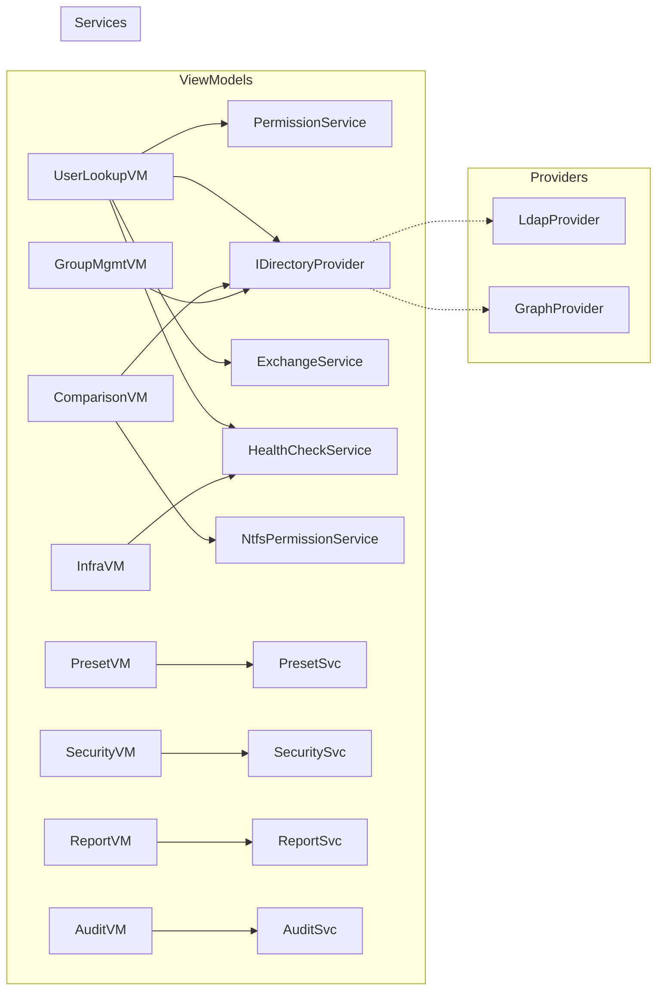

# Components

### PermissionService

**Responsibility**: Detect current user's AD group memberships at startup and map to a PermissionLevel. Provide HasPermission() for UI binding.

**Key Interfaces:**
- IPermissionService.CurrentLevel: PermissionLevel
- IPermissionService.HasPermission(PermissionLevel required): bool
- IPermissionService.DetectPermissionLevelAsync(): Task

**Dependencies**: IDirectoryProvider (to query current user's groups)

**Technology Stack**: Pure C# service, no external dependencies

### DirectoryProviders

**Responsibility**: Abstract all directory operations behind IDirectoryProvider. Two implementations: LdapDirectoryProvider (on-prem) and GraphDirectoryProvider (Entra ID).

**Key Interfaces:**
- IDirectoryProvider.SearchUsersAsync(string query): Task<List<DirectoryUser>>
- IDirectoryProvider.SearchComputersAsync(string query): Task<List<DirectoryComputer>>
- IDirectoryProvider.GetGroupsAsync(): Task<List<DirectoryGroup>>
- IDirectoryProvider.GetGroupMembersAsync(string groupDN): Task<List<string>>
- IDirectoryProvider.ModifyGroupMembershipAsync(string groupDN, string memberDN, MembershipAction action): Task
- IDirectoryProvider.ResetPasswordAsync(string userDN, string newPassword, bool mustChange): Task
- IDirectoryProvider.UnlockAccountAsync(string userDN): Task
- IDirectoryProvider.SetAccountEnabledAsync(string userDN, bool enabled): Task
- IDirectoryProvider.MoveObjectAsync(string objectDN, string targetOU): Task
- IDirectoryProvider.GetObjectAttributesAsync(string objectDN): Task<Dictionary<string, object>>
- IDirectoryProvider.SetObjectAttributesAsync(string objectDN, Dictionary<string, object> attributes): Task
- IDirectoryProvider.GetDeletedObjectsAsync(): Task<List<DeletedObject>>
- IDirectoryProvider.RestoreDeletedObjectAsync(string objectDN, string targetOU): Task
- ProviderType: DirectoryProviderType (OnPrem, Cloud, Hybrid)

**Dependencies**: System.DirectoryServices.Protocols (LDAP), Microsoft.Graph (Graph)

### ExchangeService

**Responsibility**: Query Exchange mailbox information in read-only mode. Delegates to LDAP msExch* attributes (on-prem) or Graph API (online).

**Key Interfaces:**
- IExchangeService.GetMailboxInfoAsync(string userDN): Task<ExchangeMailboxInfo?>
- IExchangeService.IsExchangeAvailable: bool

**Dependencies**: IDirectoryProvider (for LDAP attributes), Microsoft.Graph (for Exchange Online)

### PresetService

**Responsibility**: Load, validate, save, and execute presets from the configured network share.

**Key Interfaces:**
- IPresetService.GetPresetsAsync(): Task<List<Preset>>
- IPresetService.SavePresetAsync(Preset preset): Task
- IPresetService.DeletePresetAsync(Guid presetId): Task
- IPresetService.PreviewPresetAsync(Preset preset, DirectoryUser targetUser): Task<PresetDiff>
- IPresetService.ApplyPresetAsync(Preset preset, DirectoryUser targetUser): Task<PresetResult>

**Dependencies**: IDirectoryProvider, file system access to network share

### AuditService

**Responsibility**: Log all DSPanel actions to local SQLite database. Provide query/search/export capabilities.

**Key Interfaces:**
- IAuditService.LogAsync(AuditLogEntry entry): Task
- IAuditService.SearchAsync(AuditSearchCriteria criteria): Task<List<AuditLogEntry>>
- IAuditService.ExportAsync(AuditSearchCriteria criteria, ExportFormat format): Task<byte[]>

**Dependencies**: Microsoft.Data.Sqlite, Dapper

### SnapshotService

**Responsibility**: Capture AD object state before modifications and restore from snapshots.

**Key Interfaces:**
- ISnapshotService.CaptureAsync(string objectDN, string operationType): Task<ObjectSnapshot>
- ISnapshotService.GetSnapshotsAsync(string objectDN): Task<List<ObjectSnapshot>>
- ISnapshotService.RestoreAsync(long snapshotId): Task
- ISnapshotService.CleanupAsync(int retentionDays): Task

**Dependencies**: IDirectoryProvider, Microsoft.Data.Sqlite

### HealthCheckService

**Responsibility**: Compute account healthcheck badges and domain-wide health status.

**Key Interfaces:**
- IHealthCheckService.ComputeUserHealth(DirectoryUser user): AccountHealthStatus
- IHealthCheckService.GetDCHealthAsync(): Task<List<DCHealthStatus>>
- IHealthCheckService.GetReplicationStatusAsync(): Task<List<ReplicationStatus>>
- IHealthCheckService.CheckDnsHealthAsync(): Task<DnsHealthReport>
- IHealthCheckService.CheckKerberosClockAsync(): Task<ClockSkewReport>

**Dependencies**: IDirectoryProvider, DNS resolver, WMI provider

### SecurityAnalysisService

**Responsibility**: Compute domain risk score, detect AD attacks from event logs, and analyze privilege escalation paths.

**Key Interfaces:**
- ISecurityAnalysisService.ComputeRiskScoreAsync(): Task<RiskScoreReport>
- ISecurityAnalysisService.GetPrivilegedAccountsAsync(): Task<List<PrivilegedAccountInfo>>
- ISecurityAnalysisService.DetectAttacksAsync(): Task<List<SecurityAlert>>
- ISecurityAnalysisService.GetEscalationPathsAsync(): Task<EscalationGraph>

**Dependencies**: IDirectoryProvider, EventLogProvider

### NtfsPermissionService

**Responsibility**: Resolve NTFS ACLs on UNC paths and cross-reference with AD group memberships.

**Key Interfaces:**
- INtfsPermissionService.GetPermissionsAsync(string uncPath): Task<List<AclEntry>>
- INtfsPermissionService.AnalyzeUserAccessAsync(string uncPath, string userDN): Task<AccessAnalysis>
- INtfsPermissionService.CompareUserAccessAsync(string uncPath, string userDN1, string userDN2): Task<AccessComparison>

**Dependencies**: System.Security.AccessControl, IDirectoryProvider

### WmiMonitoringService

**Responsibility**: Query remote workstation status via WMI/CIM.

**Key Interfaces:**
- IWmiMonitoringService.GetSystemInfoAsync(string computerName): Task<SystemInfo>
- IWmiMonitoringService.GetRunningServicesAsync(string computerName): Task<List<ServiceInfo>>
- IWmiMonitoringService.GetActiveSessionsAsync(string computerName): Task<List<SessionInfo>>

**Dependencies**: System.Management

### ReportService

**Responsibility**: Generate scheduled and on-demand reports.

**Key Interfaces:**
- IReportService.GenerateReportAsync(ReportType type, ReportParameters parameters): Task<ReportResult>
- IReportService.ScheduleReportAsync(ScheduledReport schedule): Task
- IReportService.GetScheduledReportsAsync(): Task<List<ScheduledReport>>

**Dependencies**: IDirectoryProvider, ExportService

### ExportService

**Responsibility**: Export data to CSV and PDF formats.

**Key Interfaces:**
- IExportService.ExportToCsvAsync<T>(IEnumerable<T> data, string filePath): Task
- IExportService.ExportToPdfAsync(ReportResult report, string filePath): Task

**Dependencies**: CsvHelper, QuestPDF

### NotificationService

**Responsibility**: Send webhook notifications to Teams, Slack, or email.

**Key Interfaces:**
- INotificationService.SendAsync(NotificationEvent event): Task
- INotificationService.TestChannelAsync(NotificationChannel channel): Task<bool>

**Dependencies**: HttpClient

### NavigationService

**Responsibility**: Manage view navigation in the WPF shell (sidebar, tabs, dialogs).

**Key Interfaces:**
- INavigationService.NavigateTo<TViewModel>(object? parameter): void
- INavigationService.OpenTab<TViewModel>(object? parameter): void
- INavigationService.ShowDialog<TViewModel>(object? parameter): Task<bool?>

**Dependencies**: WPF Dispatcher, DI container

### Component Diagram

---

