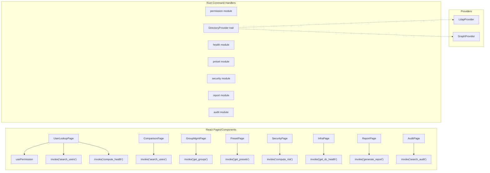

# Components

### permission module

**Responsibility**: Detect current user's AD group memberships at startup and map to a PermissionLevel. Provide permission checking for both Rust commands and React UI binding.

**Key Functions (Rust):**
- `get_current_level() -> PermissionLevel`
- `has_permission(required: PermissionLevel) -> bool`
- `detect_permission_level() -> Result<PermissionLevel>`

**Frontend**: `usePermission()` hook + `PermissionContext` provider

**Dependencies**: DirectoryProvider trait (to query current user's groups)

### DirectoryProviders

**Responsibility**: Abstract all directory operations behind the `DirectoryProvider` trait. Two implementations: `LdapDirectoryProvider` (on-prem) and `GraphDirectoryProvider` (Entra ID).

**Key Trait Methods (Rust):**
- `search_users(query: &str) -> Result<Vec<DirectoryUser>>`
- `search_computers(query: &str) -> Result<Vec<DirectoryComputer>>`
- `get_groups() -> Result<Vec<DirectoryGroup>>`
- `get_group_members(group_dn: &str) -> Result<Vec<String>>`
- `modify_group_membership(group_dn: &str, member_dn: &str, action: MembershipAction) -> Result<()>`
- `reset_password(user_dn: &str, new_password: &str, must_change: bool) -> Result<()>`
- `unlock_account(user_dn: &str) -> Result<()>`
- `set_account_enabled(user_dn: &str, enabled: bool) -> Result<()>`
- `move_object(object_dn: &str, target_ou: &str) -> Result<()>`
- `get_object_attributes(object_dn: &str) -> Result<HashMap<String, serde_json::Value>>`
- `set_object_attributes(object_dn: &str, attributes: HashMap<String, serde_json::Value>) -> Result<()>`
- `get_deleted_objects() -> Result<Vec<DeletedObject>>`
- `restore_deleted_object(object_dn: &str, target_ou: &str) -> Result<()>`
- `provider_type() -> DirectoryProviderType`

**Dependencies**: ldap3 crate (LDAP), reqwest (Graph API)

### exchange module

**Responsibility**: Query Exchange mailbox information in read-only mode. Delegates to LDAP msExch* attributes (on-prem) or Graph API (online).

**Key Functions (Rust):**
- `get_mailbox_info(user_dn: &str) -> Result<Option<ExchangeMailboxInfo>>`
- `is_exchange_available() -> bool`

**Dependencies**: DirectoryProvider trait (for LDAP attributes), reqwest (for Exchange Online)

### preset module

**Responsibility**: Load, validate, save, and execute presets from the configured network share.

**Key Functions (Rust):**
- `get_presets() -> Result<Vec<Preset>>`
- `save_preset(preset: &Preset) -> Result<()>`
- `delete_preset(preset_id: Uuid) -> Result<()>`
- `preview_preset(preset: &Preset, target_user: &DirectoryUser) -> Result<PresetDiff>`
- `apply_preset(preset: &Preset, target_user: &DirectoryUser) -> Result<PresetResult>`

**Dependencies**: DirectoryProvider trait, file system access to network share

### audit module

**Responsibility**: Log all DSPanel actions to local SQLite database. Provide query/search/export capabilities.

**Key Functions (Rust):**
- `log(entry: &AuditLogEntry) -> Result<()>`
- `search(criteria: &AuditSearchCriteria) -> Result<Vec<AuditLogEntry>>`
- `export(criteria: &AuditSearchCriteria, format: ExportFormat) -> Result<Vec<u8>>`

**Dependencies**: rusqlite

### snapshot module

**Responsibility**: Capture AD object state before modifications and restore from snapshots.

**Key Functions (Rust):**
- `capture(object_dn: &str, operation_type: &str) -> Result<ObjectSnapshot>`
- `get_snapshots(object_dn: &str) -> Result<Vec<ObjectSnapshot>>`
- `restore(snapshot_id: i64) -> Result<()>`
- `cleanup(retention_days: i32) -> Result<()>`

**Dependencies**: DirectoryProvider trait, rusqlite

### health module

**Responsibility**: Compute account healthcheck badges and domain-wide health status.

**Key Functions (Rust):**
- `compute_user_health(user: &DirectoryUser) -> AccountHealthStatus`
- `get_dc_health() -> Result<Vec<DCHealthStatus>>`
- `get_replication_status() -> Result<Vec<ReplicationStatus>>`
- `check_dns_health() -> Result<DnsHealthReport>`
- `check_kerberos_clock() -> Result<ClockSkewReport>`

**Dependencies**: DirectoryProvider trait, DNS resolver

### security module

**Responsibility**: Compute domain risk score, detect AD attacks from event logs, and analyze privilege escalation paths.

**Key Functions (Rust):**
- `compute_risk_score() -> Result<RiskScoreReport>`
- `get_privileged_accounts() -> Result<Vec<PrivilegedAccountInfo>>`
- `detect_attacks() -> Result<Vec<SecurityAlert>>`
- `get_escalation_paths() -> Result<EscalationGraph>`

**Dependencies**: DirectoryProvider trait

### report module

**Responsibility**: Generate scheduled and on-demand reports.

**Key Functions (Rust):**
- `generate_report(report_type: ReportType, parameters: &ReportParameters) -> Result<ReportResult>`
- `schedule_report(schedule: &ScheduledReport) -> Result<()>`
- `get_scheduled_reports() -> Result<Vec<ScheduledReport>>`

**Dependencies**: DirectoryProvider trait, export module

### export module

**Responsibility**: Export data to CSV and PDF formats.

**Key Functions (Rust):**
- `export_to_csv<T: Serialize>(data: &[T], file_path: &Path) -> Result<()>`
- `export_to_pdf(report: &ReportResult, file_path: &Path) -> Result<()>`

**Dependencies**: csv crate, printpdf/genpdf crate

### notification module

**Responsibility**: Send webhook notifications to Teams, Slack, or email.

**Key Functions (Rust):**
- `send(event: &NotificationEvent) -> Result<()>`
- `test_channel(channel: &NotificationChannel) -> Result<bool>`

**Dependencies**: reqwest

### Frontend Navigation

**Responsibility**: Manage page navigation in the React app shell (sidebar, tabs, dialogs).

**Implementation**: React Router + custom navigation context

**Key Hooks:**
- `useNavigation().navigateTo(path: string, params?: object)`
- `useNavigation().openTab(path: string, params?: object)`
- `useDialog().showDialog(component: ReactNode)`

### Component Diagram

---
