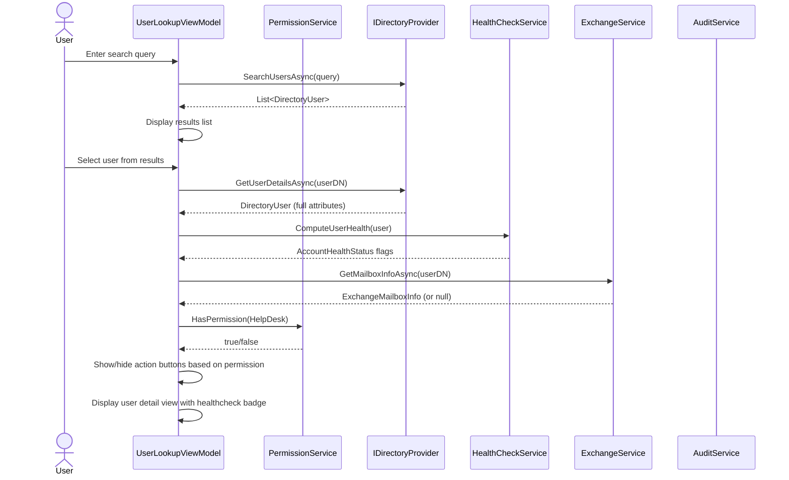
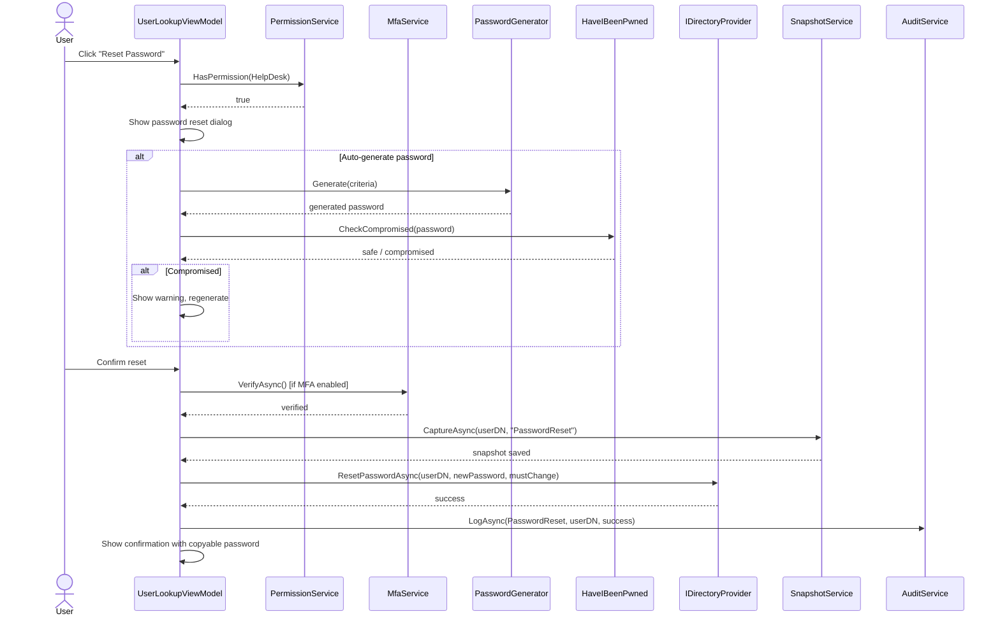
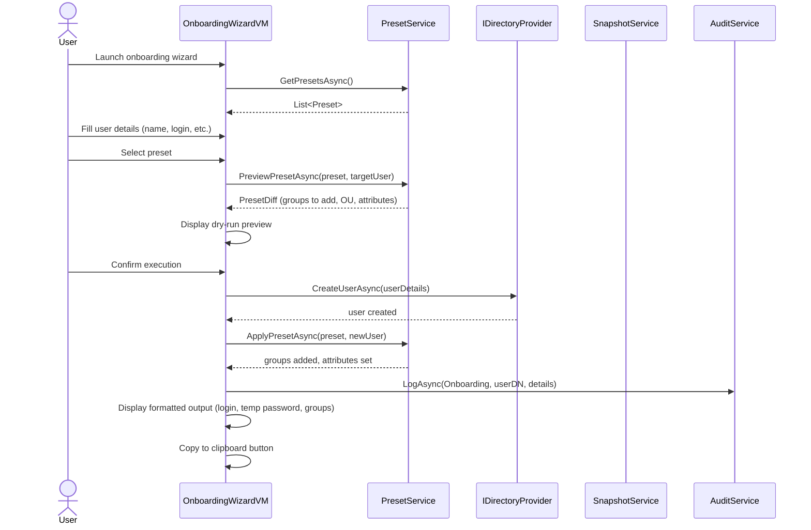
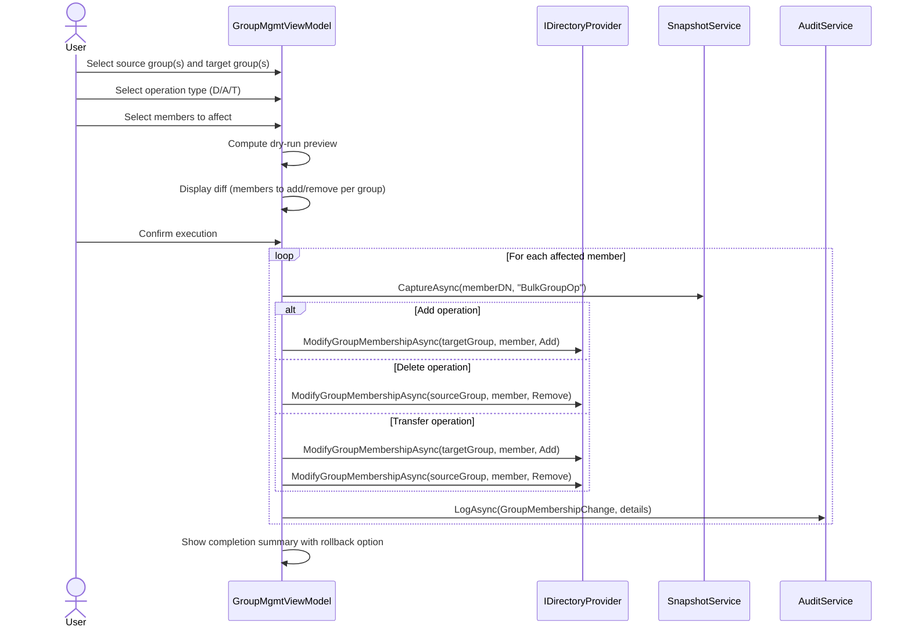

# Core Workflows

### User Lookup Workflow

```mermaid
sequenceDiagram
    actor User
    participant VM as UserLookupViewModel
    participant Perm as PermissionService
    participant Dir as IDirectoryProvider
    participant Health as HealthCheckService
    participant Exch as ExchangeService
    participant Audit as AuditService

    User->>VM: Enter search query
    VM->>Dir: SearchUsersAsync(query)
    Dir-->>VM: List<DirectoryUser>
    VM->>VM: Display results list

    User->>VM: Select user from results
    VM->>Dir: GetUserDetailsAsync(userDN)
    Dir-->>VM: DirectoryUser (full attributes)
    VM->>Health: ComputeUserHealth(user)
    Health-->>VM: AccountHealthStatus flags
    VM->>Exch: GetMailboxInfoAsync(userDN)
    Exch-->>VM: ExchangeMailboxInfo (or null)
    VM->>Perm: HasPermission(HelpDesk)
    Perm-->>VM: true/false
    VM->>VM: Show/hide action buttons based on permission
    VM->>VM: Display user detail view with healthcheck badge
```

### Password Reset Workflow

```mermaid
sequenceDiagram
    actor User
    participant VM as UserLookupViewModel
    participant Perm as PermissionService
    participant MFA as MfaService
    participant PwdGen as PasswordGenerator
    participant HIBP as HaveIBeenPwned
    participant Dir as IDirectoryProvider
    participant Snap as SnapshotService
    participant Audit as AuditService

    User->>VM: Click "Reset Password"
    VM->>Perm: HasPermission(HelpDesk)
    Perm-->>VM: true
    VM->>VM: Show password reset dialog

    alt Auto-generate password
        VM->>PwdGen: Generate(criteria)
        PwdGen-->>VM: generated password
        VM->>HIBP: CheckCompromised(password)
        HIBP-->>VM: safe / compromised
        alt Compromised
            VM->>VM: Show warning, regenerate
        end
    end

    User->>VM: Confirm reset
    VM->>MFA: VerifyAsync() [if MFA enabled]
    MFA-->>VM: verified
    VM->>Snap: CaptureAsync(userDN, "PasswordReset")
    Snap-->>VM: snapshot saved
    VM->>Dir: ResetPasswordAsync(userDN, newPassword, mustChange)
    Dir-->>VM: success
    VM->>Audit: LogAsync(PasswordReset, userDN, success)
    VM->>VM: Show confirmation with copyable password
```

### Onboarding Wizard Workflow

```mermaid
sequenceDiagram
    actor User
    participant Wizard as OnboardingWizardVM
    participant Preset as PresetService
    participant Dir as IDirectoryProvider
    participant Snap as SnapshotService
    participant Audit as AuditService

    User->>Wizard: Launch onboarding wizard
    Wizard->>Preset: GetPresetsAsync()
    Preset-->>Wizard: List<Preset>

    User->>Wizard: Fill user details (name, login, etc.)
    User->>Wizard: Select preset
    Wizard->>Preset: PreviewPresetAsync(preset, targetUser)
    Preset-->>Wizard: PresetDiff (groups to add, OU, attributes)
    Wizard->>Wizard: Display dry-run preview

    User->>Wizard: Confirm execution
    Wizard->>Dir: CreateUserAsync(userDetails)
    Dir-->>Wizard: user created
    Wizard->>Preset: ApplyPresetAsync(preset, newUser)
    Preset-->>Wizard: groups added, attributes set
    Wizard->>Audit: LogAsync(Onboarding, userDN, details)
    Wizard->>Wizard: Display formatted output (login, temp password, groups)
    Wizard->>Wizard: Copy to clipboard button
```

### Bulk Group Operation Workflow

```mermaid
sequenceDiagram
    actor User
    participant VM as GroupMgmtViewModel
    participant Dir as IDirectoryProvider
    participant Snap as SnapshotService
    participant Audit as AuditService

    User->>VM: Select source group(s) and target group(s)
    User->>VM: Select operation type (D/A/T)
    User->>VM: Select members to affect

    VM->>VM: Compute dry-run preview
    VM->>VM: Display diff (members to add/remove per group)

    User->>VM: Confirm execution
    loop For each affected member
        VM->>Snap: CaptureAsync(memberDN, "BulkGroupOp")
        alt Add operation
            VM->>Dir: ModifyGroupMembershipAsync(targetGroup, member, Add)
        else Delete operation
            VM->>Dir: ModifyGroupMembershipAsync(sourceGroup, member, Remove)
        else Transfer operation
            VM->>Dir: ModifyGroupMembershipAsync(targetGroup, member, Add)
            VM->>Dir: ModifyGroupMembershipAsync(sourceGroup, member, Remove)
        end
        VM->>Audit: LogAsync(GroupMembershipChange, details)
    end
    VM->>VM: Show completion summary with rollback option
```

---

