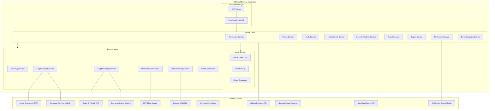

# High Level Architecture

### Technical Summary

DSPanel is a Windows desktop monolith built with WPF and .NET 10, following the MVVM pattern via CommunityToolkit.Mvvm. The application connects to Active Directory on-prem (via LDAP using System.DirectoryServices.Protocols) and optionally to Entra ID / Exchange Online (via Microsoft Graph SDK), abstracted behind an `IDirectoryProvider` adapter pattern. A permission system detects the current Windows user's AD group memberships at startup and dynamically controls UI visibility. Local storage is limited to audit logs (SQLite), user settings, and object snapshots. Presets are stored externally as JSON files on a configurable network share.

### High Level Overview

1. **Architectural style**: Desktop monolith with internal modular layering (Presentation / Service / Provider)
2. **Repository structure**: Monorepo - single solution containing the WPF app project, test project, and documentation
3. **Service architecture**: Layered architecture within a single process - ViewModels call Services, Services call Providers
4. **Primary user flow**: User launches app - permission level detected - UI adapts - user searches AD objects - views details - performs actions (gated by permission level) - all actions logged
5. **Key decisions**: Adapter pattern for directory abstraction (on-prem vs cloud), permission-based UI gating, external preset storage, local SQLite for audit

### High Level Project Diagram

### Architectural and Design Patterns

- **MVVM (Model-View-ViewModel)**: CommunityToolkit.Mvvm with source generators for ObservableObject and RelayCommand. Rationale: standard WPF pattern, clean separation of UI and logic, enables unit testing of ViewModels without UI.

- **Adapter Pattern (IDirectoryProvider)**: Abstract interface for all directory operations with concrete implementations for LDAP (on-prem) and Graph (cloud). Rationale: enables seamless hybrid support and testability via mocking.

- **Dependency Injection**: Microsoft.Extensions.DependencyInjection with Hosting for app lifecycle. Rationale: standard .NET DI, enables testability, clean service registration, aligns with IDirectoryProvider pattern.

- **Repository Pattern (for local storage)**: SQLite access for audit logs and snapshots abstracted behind interfaces. Rationale: keeps data access testable and swappable.

- **Observer Pattern (for permissions)**: UI elements bind to permission-level observable properties that trigger visibility/enabled state changes. Rationale: reactive UI adaptation without polling or manual refresh.

- **Strategy Pattern (for presets)**: Preset engine selects the appropriate onboarding/offboarding strategy based on preset type. Rationale: extensible workflow execution.

- **Command Pattern**: All write operations are encapsulated as commands with undo capability (object snapshots). Rationale: enables dry-run preview, audit logging, and rollback.

---

