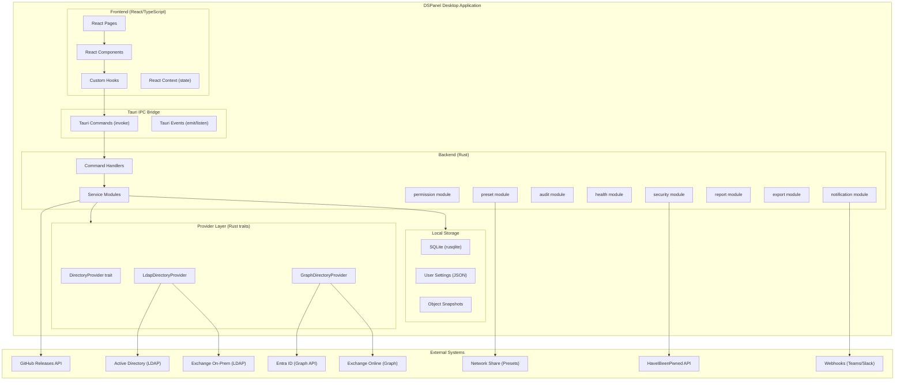

# High Level Architecture

### Technical Summary

DSPanel is a cross-platform desktop application built with Tauri v2, using a Rust backend and a React/TypeScript frontend. The Rust backend connects to Active Directory on-prem (via LDAP using the ldap3 crate) and optionally to Entra ID / Exchange Online (via Microsoft Graph REST API using reqwest), abstracted behind a `DirectoryProvider` trait. A permission system detects the current user's AD group memberships at startup and dynamically controls UI visibility via React context. Local storage is limited to audit logs (SQLite via rusqlite), user settings, and object snapshots. Presets are stored externally as JSON files on a configurable network share.

### High Level Overview

1. **Architectural style**: Tauri hybrid app with Rust backend (system operations) and React frontend (UI), connected via IPC commands
2. **Repository structure**: Monorepo - `src-tauri/` for Rust backend, `src/` for React/TypeScript frontend, and documentation
3. **Service architecture**: Frontend components invoke Tauri commands, which delegate to Rust service modules and provider traits
4. **Primary user flow**: User launches app - permission level detected - UI adapts - user searches AD objects - views details - performs actions (gated by permission level) - all actions logged
5. **Key decisions**: Trait-based adapter pattern for directory abstraction (on-prem vs cloud), permission-based UI gating, external preset storage, local SQLite for audit

### High Level Project Diagram

### Architectural and Design Patterns

- **Component Architecture + Tauri Commands**: React components with hooks for state management, invoking Rust backend via Tauri's `invoke()` IPC. Rationale: clean separation of UI and system logic, type-safe IPC boundary, enables independent testing of both layers.

- **Adapter Pattern (DirectoryProvider trait)**: Rust trait for all directory operations with concrete implementations for LDAP (on-prem) and Graph (cloud). Rationale: enables seamless hybrid support and testability via mock implementations.

- **Dependency Injection (Tauri managed state)**: Tauri's managed state (`app.manage()`) for sharing service instances across commands. Rationale: simple, built-in to Tauri, no external DI framework needed.

- **Repository Pattern (for local storage)**: SQLite access for audit logs and snapshots abstracted behind Rust traits. Rationale: keeps data access testable and swappable.

- **Observer Pattern (for permissions)**: React context provides permission level to the component tree, triggering re-renders when permissions change. Rationale: reactive UI adaptation without polling or manual refresh.

- **Strategy Pattern (for presets)**: Preset engine selects the appropriate onboarding/offboarding strategy based on preset type. Rationale: extensible workflow execution.

- **Command Pattern**: All write operations are encapsulated as commands with undo capability (object snapshots). Rationale: enables dry-run preview, audit logging, and rollback.

---
